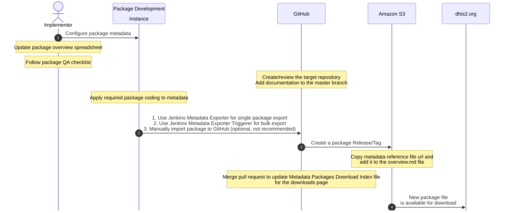
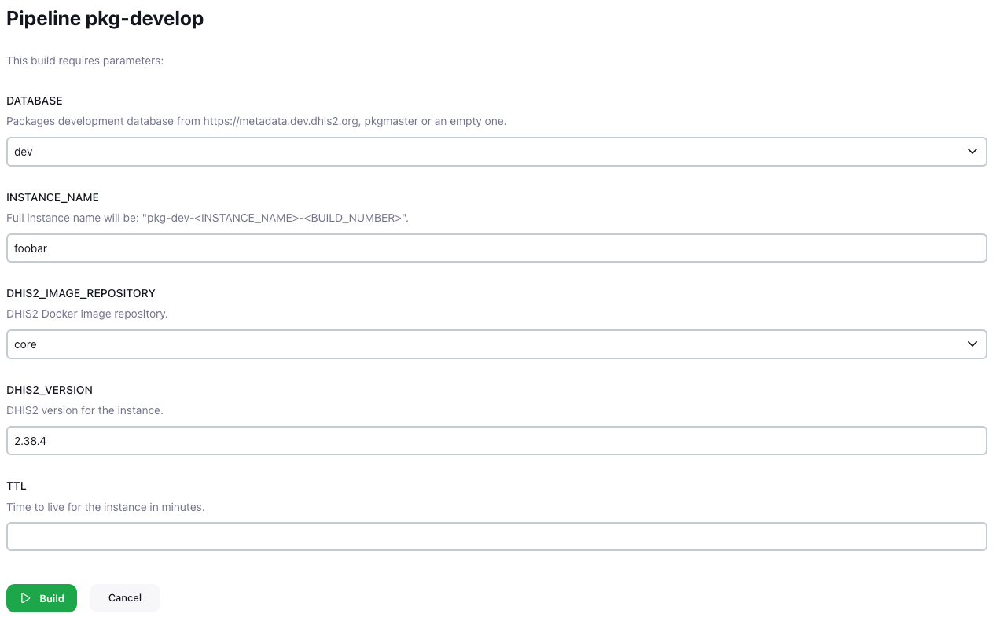
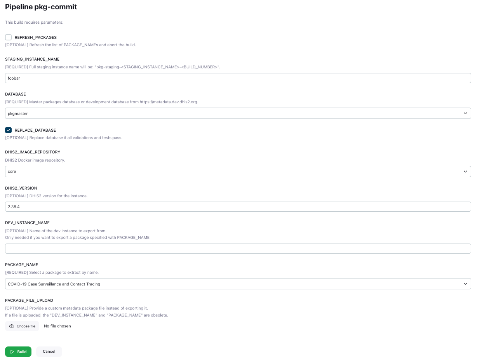
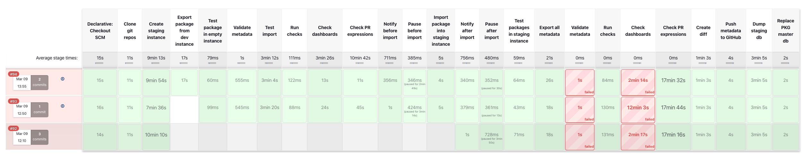
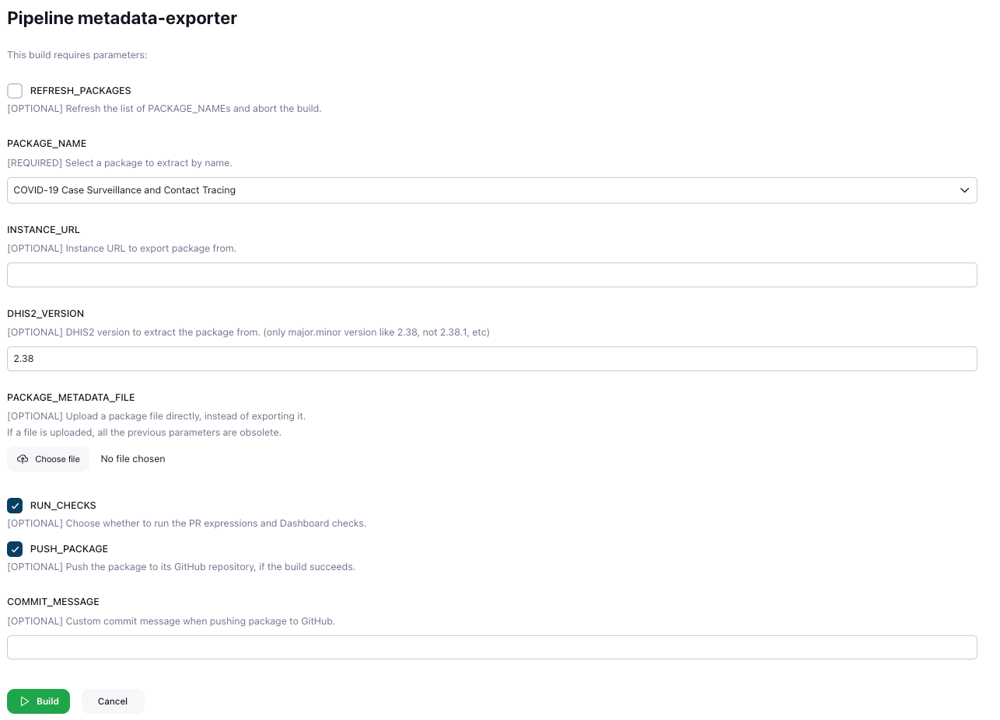
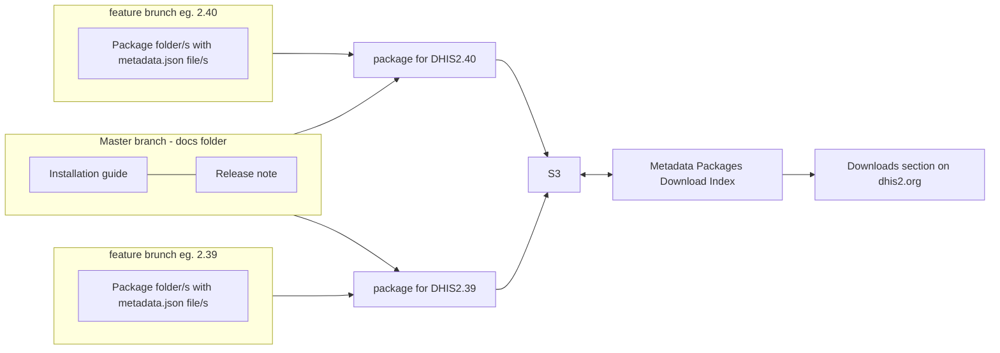

# DHIS2 Metadata Package Development Guide

<!-- START doctoc generated TOC please keep comment here to allow auto update -->
<!-- DON'T EDIT THIS SECTION, INSTEAD RE-RUN doctoc TO UPDATE -->
**Table of Contents**

- [Getting Started](#getting-started)
  - [Prerequisites](#prerequisites)
  - [Process Overview](#process-overview)
  - [Metadata Packages Development & Staging diagram](#metadata-packages-development--staging-diagram)
- [Developing Metadata Packages](#developing-metadata-packages)
  - [Metadata Packages Index spreadsheet](#metadata-packages-index-spreadsheet)
    - [Columns](#columns)
  - [Develop pipeline](#develop-pipeline)
    - [Parameters](#parameters)
- [Committing Metadata Package Changes](#committing-metadata-package-changes)
  - [Commit pipeline](#commit-pipeline)
    - [Parameters](#parameters-1)
  - [Commit pipeline workflows](#commit-pipeline-workflows)
    - [“Standard” workflow](#standard-workflow)
    - [“Manually upload a package” workflow](#manually-upload-a-package-workflow)
    - [“Create a staging instance for maintenance” workflow](#create-a-staging-instance-for-maintenance-workflow)
- [Exporting Metadata Packages](#exporting-metadata-packages)
  - [Exporter pipeline](#exporter-pipeline)
    - [Parameters](#parameters-2)
  - [Export Triggerer pipeline](#export-triggerer-pipeline)
- [Releasing Metadata Packages](#releasing-metadata-packages)
- [Overview](#overview)
  - [Publish workflow summary](#publish-workflow-summary)
  - [How to add the Publish workflow to a given branch](#how-to-add-the-publish-workflow-to-a-given-branch)
  - [How to create new a Release and Tag](#how-to-create-new-a-release-and-tag)

<!-- END doctoc generated TOC please keep comment here to allow auto update -->

---

## Getting Started

### Prerequisites

Before you begin, ensure you have the following:

- Collaborator access to [dhis2-metadata GitHub organisation](https://github.com/dhis2-metadata)
- Access to [Jenkins](https://jenkins)
- Access to the [Metadata Packages Index spreadsheet](#metadata-packages-index-spreadsheet)
- Access to [DHIS2 S3](https://s3.console.aws.amazon.com/s3/home) (optional)
- Basic knowledge of markdown syntax. [Markdown support and extensions guide](https://docs.dhis2.org/en/implement/support-and-documentation/dhis2-documentation-guide.html?h=markdown#markdown_support_and_extensions) provides an overview of supported functionality. The structure of markdown documents is addressed in the [Markdown File Structure](#markdown-file-structure) section.

[//]: # (TODO any extra resources for package development or other prerequisites?)

### Process Overview

[//]: # (TODO this diagram needs updating/rewording to make it eaisier to comprehend)


### Metadata Packages Development & Staging diagram

[The Metadata Packages Development & Staging workflow diagram](https://docs.google.com/presentation/d/1_LRb4_w1rnNUkG8kaJr9EQJj_tHp6Xd4-t-8MY8uZDk/edit#slide=id.g1d68b1d873c_0_7) is supposed to represent the following two sections - [Developing Metadata Packages](#developing-metadata-packages) and [Committing Metadata Package Changes](#committing-metadata-package-changes).

---

## Developing Metadata Packages

### [Metadata Packages Index spreadsheet](https://docs.google.com/spreadsheets/d/1IIQL2IkGJqiIWLr6Bgg7p9fE78AwQYhHBNGoV-spGOM)

The Metadata Packages Index spreadsheet is the source-of-truth for Metadata Package details like Package Code, Package Name, Component Name, Health Area (name and code), etc.
This means that changes should be done carefully and should be communicated with the team.

#### Columns
The spreadsheet contains two "checkbox" columns that are used to distinguish packages and control how the spreadsheet is parsed by the [Exporter](#exporter-pipeline) and [Export Triggerer](#export-triggerer-pipeline) pipelines.
The rest are standard text columns containing details about exporting a given package.

* `Enabled` - enables packages for parsing by the pipelines below; any package that you would like to like to see in the `PACKAGE_NAME` parameter list for the [Exporter pipeline](#exporter-pipeline) has to be enabled in this column
* `Ready for Export` - enables exporting for packages by the [Export Triggerer pipeline](#export-triggerer-pipeline) and can be used to export a list of packages at once without having to start builds of the [Exporter pipeline](#exporter-pipeline) manually for each package; note that the checkboxes in this column are reset back to "false/unchecked" after each build of the Export Triggerer pipeline
* `Package Code` - the code used to distinguish a given package from the rest
* `Package Type` - abbreviated version of the type of the package
* `Type Name` - human-friendly version of the type of the package
* `Supported DHIS2 Versions` -  a comma-separated list of DHIS2 versions that the given package can and should be exported from (currently, not in the past)
* `Source Instance` - the instance and database that contain the package (where it can be exported from)
* `Component Name` - the unique name of each package component, like "TB Aggregate (complete)"
* `Package Name` - a broader name of the whole package (that may contain multiple Components), like "TB HMIS"
* `Health Area` - human-friendly name of the health area the package is part of
* `Health Area Code` - abbreviated version of the health area

### Develop pipeline

To create a DHIS2 instance for developing Metadata packages, you can use the [pkg-develop Jenkins pipeline](https://jenkins/job/test-pkg-develop).
Development instances are created via [the Instance Manager](https://im.dhis2.org) and are using our [DHIS2 Docker images](https://hub.docker.com/u/dhis2).

The Develop pipeline is meant to help Metadata Package developers/implementers create their own, separated DHIS2 instance for working on packages.
Each instance is using a separate environment with a separate database, with the idea of not messing with each other's progress and getting in the way.



#### Parameters

* `DATABASE` - selects the packages database to start the DHIS2 instance with:
  * `dev` - the aggregate packages database
  * `tracker_dev` - the tracker packages database
  * `pkgmaster` - the Package Master database (`dev` and `tracker_dev` merged together)
  * `empty` - an empty database
* `INSTANCE_NAME` - part of the development instance name, so it's easier to distinguish between instances and their purpose
* `DHIS2_IMAGE_REPOSITORY` - the DockerHub image repository
  * `core` - https://hub.docker.com/r/dhis2/core (only stable releases and release candidates)
  * `core-dev` - https://hub.docker.com/r/dhis2/core-dev (development releases)
* `DHIS2_VERSION` - the DHIS2 verison to use; note that it has to be a valid `tag` from one of the DockerHub repositories above
* `TTL` - the Time To Live of the instance, in case it's only temporary and the user would like to get it cleand up automatically; by default "development" instances will exist until manually deleted

---

## Committing Metadata Package Changes

Commiting (or saving) Metadata Package changes can be done via the [pkg-commit Jenkins pipeline](https://jenkins/job/test-pkg-commit).

### Commit pipeline

The Commit pipeline is meant for "commiting/saving" progress while developing Metadata Packages and "merging" it into the `pkgmaster` database.
It creates a “staging” instance and does all the rest of the work (testing, exporting all metadata, creating a diff, etc).



#### Parameters

* `REFRESH_PACKAGES` - checkbox can be used to refresh the list of packages in the `PACKAGE_NAME` parameter dropdown; this is helpful because the `PACKAGE_NAME` parameter list is parsed upon triggering a build, hence if any changes were made to the spreadsheet they won’t be automatically picked up without triggering a build first; so if a user ends up in a situation where the dropdown list is not in sync with the spreadsheet - triggering a build with that checkbox checked will refresh the list and abort the build afterwards
* `STAGING_INSTANCE_NAME` - part of the staging instance name, so it's easier to distinguish between instances and their purpose
* `DATABASE` - selects the packages database to start the DHIS2 instance with:
  * `pkgmaster` - the Package Master database (`dev` and `tracker_dev` merged together)
  * `dev` - the aggregate packages database
  * `tracker_dev` - the tracker packages database
* `REPLACE_DATABASE` - choose whether to replace (overwrite) the selected database at the end of the pipeline; this basically enables "merging" packages into the selected database
* `DHIS2_IMAGE_REPOSITORY` - the DockerHub image repository
  * `core` - https://hub.docker.com/r/dhis2/core (only stable releases and release candidates)
  * `core-dev` - https://hub.docker.com/r/dhis2/core-dev (development releases)
* `DHIS2_VERSION` - the DHIS2 verison to use; note that it has to be a valid `tag` from one of the DockerHub repositories above
* `DEV_INSTANCE_NAME` - the full development instance name to export the selected package from
* `PACKAGE_NAME` - name of the package to export; populated by the [packages spreadsheet](#metadata-packages-index-spreadsheet), and based on what a user selects - the rest of the required parameters for exporting a package are also taken from that spreadsheet
* `PACKAGE_FILE_UPLOAD` - can be used to upload a package file directly, instead of exporting it from a development instance (for example, just for testing it)

With all of the parameters above, the pipeline is able to:
* Use either:
  * an uploaded package
  * a package exported from a development instance
  * no package at all, just to start a staging instance for maintenance, for example
* Pause before and after importing into the staging instance (with a notification in Slack)
  * Pausing stops the execution of the pipeline until the user resumes it, which allows the user to do manual maintenance or testing
  * During the pausing stages, the user can choose to delete the development instance  (specified in the `DEV_INSTANCE_NAME` parameter) at the end of the pipeline
* Test the imported package (either manually uploaded or exported from a dev instance) in an empty DHIS2 instance, as well as testing the whole staging instance afterwards
* Export all the metadata from the staging instance, creating a diff with the previous version of it via the [metadatapackagediff tool](https://github.com/dhis2/dhis2-utils/tree/master/tools/dhis2-metadatapackagediff) (the .xlsx diff file can be found as an archived artifact in the build, for example see here) and pushing the newly exported version to this GitHub repo - https://github.com/dhis2-metadata/ALL_METADATA


In the screenshot below, you can see the three main variations of the builds:
* #92 - No dev instance specified and no package file uploaded
* #93 - No dev instance specified and package file uploaded
* #94 - Dev instance specified and no package file uploaded



Note that if you both specify a dev instance and upload a package, the dev instance export will take precedence.

### Commit pipeline workflows

#### “Standard” workflow
1. Create a dev instance with the pkg-develop pipeline with `INSTANCE_NAME` set to “foobar”, for example. This instance will be used to export the package specified in `PACKAGE_NAME`.
2. Wait for the pkg-develop pipeline build to complete and create the instance.
3. Create a staging instance with the pkg-commit pipeline choose the `pkgmaster` option for the `DATABASE` parameter and set `DEV_INSTANCE_NAME` to the final instance name of the development instance created in the previous step - in case you used “foobar” for `INSTANCE_NAME`, the final name will be `pkg-dev-foobar-<build number>`. This instance will be used to test the exported package from the development instance, import it and test the whole instance (or actually database).
4. Wait for the pkg-commit pipeline build to complete. Note that there are 2 “pause” stages (before and after importing the package into the staging instance) that allow for manual interventions on the staging instance. These pause stages will have to be “resumed” manually through the Jenkins UI. Finally all the metadata is exported and pushed to GitHub if the dashboard and PR checks pass.
5. The Package Master database is replaced with the new version (that includes the newly imported package).

#### “Manually upload a package” workflow
1. Upload a package file to the pkg-commit pipeline. Don’t input `DEV_INSTANCE_NAME` or `PACKAGE_NAME`.
2. Wait for the pkg-commit pipeline build to complete. Note that this is almost the same as the “Standard” workflow, but instead of using a development instance to export the package from - the user uploads the package manually. The package still goes through the same tests and validations.
3. The Package Master database is replaced with the new version (that includes the newly imported package).

#### “Create a staging instance for maintenance” workflow
1. Only input `STAGING_INSTANCE_NAME`, don’t upload package file or input `DEV_INSTANCE_NAME` and `PACKAGE_NAME`.
2. Wait for the pkg-commit pipeline build to complete. Note that this workflow could be used to apply changes to the Package Master database (i.e. tracker + aggregate database) or some other maintenance task.
3. The Package Master database is replaced with the new version (that includes the changes done by the user during the Pause stages).

---

## Exporting Metadata Packages

### Exporter pipeline

[The Exporter pipeline](https://jenkins/job/test-metadata-exporter-v2) export a Metadata Package from a given instance, tests it (by importing into an empty DHIS2 instance, validating the metadata and running the PR expressions and Dashboard checks) and finally pushes the package to its GitHub repository (based on the Package Code).
This is the final export and testing of a package, after that the only step that remains is releasing the package once it's considered ready.



#### Parameters

* `REFRESH_PACKAGES` - checkbox can be used to refresh the list of packages in the `PACKAGE_NAME` parameter dropdown. This is helpful because the `PACKAGE_NAME` parameter list is parsed upon triggering a build, hence if any changes were made to the spreadsheet they won’t be automatically picked up without triggering a build first. So if a user ends up in a situation where the dropdown list is not in sync with the spreadsheet - triggering a build with that checkbox checked will refresh the list and abort the build afterwards.
* `PACKAGE_NAME`- name of the package to export; populated by the [packages spreadsheet](#metadata-packages-index-spreadsheet), and based on what a user selects - the rest of the required parameters for exporting a package are also taken from that spreadsheet.
* `INSTANCE_URL` - can be used to extract a package from a different Instance from the one specified in the packages spreadsheet. Currently the “default” instance for most packages is either https://metadata.dev.dhis2.org/tracker_dev or https://metadata.dev.dhis2.org/dev (with some exceptions), so if for some reason you’d like to export a package from a different one - that parameter would allow you to do so.
* `DHIS2_VERSION` - can be used to change the version you’d like to export a package from. This defaults to the 2.38, which is the currently the “base” version for developing packages. Note that using a different version would also change the instance that the package is exported from. Currently the “default” instances for exporting from a higher versions are on the https://who-dev.dhis2.org server. If you’d like to export a package from a different instance for a higher version of DHIS2, you can specify the `INSTANCE_URL` parameter and leave `DHIS2_VERSION` empty.
* `PACKAGE_FILE_UPLOAD` - can be used to upload a package file directly, instead of exporting it (for example, just for testing it).
* `RUN_CHECKS` - chechbox can be used to disable the PR expression and Dashboard checks; enabled by default.
* `PUSH_PACKAGE` - checkbox can be used to disable pushing the package to its GitHub repo, if the tests pass; enabled by default.
* `COMMIT_MESSAGE` - optional custom commit message when pushing the package to GitHub; by default the message is "feat: Update <package-code> package"

##### Pushing to GitHub
Pushing packages to GitHub requires that:

* the github repository for a particular package exists (based on the package code, e.g. `HIV_CS` or `TB_AGG`)
* a _feature branch_ exists in the repository for the version you are pushing (e.g. 2.39, 2.40)

The feature branch can be created from either master or a previous feature branch, removing the existing files/folders after branching. The key requirements is that the branch includes the ["Publish" GitHub Workflow](https://github.com/dhis2-metadata/gha-workflows/blob/master/.github/workflows/publish.yaml) (see the section on releasing packages).


### Export Triggerer pipeline

Triggering export of multiple packages via the [packages index spreadsheet](#metadata-packages-index-spreadsheet) and [Export Triggerer Jenkins pipeline](https://jenkins/job/metadata-export-triggerer).

This pipeline doesn't have any build parameters, instead it's behaviour is solely controlled by the [packages index spreadsheet](#metadata-packages-index-spreadsheet). It's run on a nightly schedule at ~18PM UTC.

You can check the `Ready for Export` on any number of packages, but note that the `DHIS2 versions to export from` column controls which versions of DHIS2 will the package be exported from.
Hence, if you check the `Ready for Export` column on 5 packages and each of those has 3 `DHIS2 versions to export from` listed, this will result in a total number of 15 builds of the [Export pipeline](#exporter-pipeline).

The pipeline will reset all the checkboxes in the `Ready for Export` on each build, in order to prevent unwanted behaviour and result in unneccesary re-exporting of packages.

---

## Releasing Metadata Packages

Releasing/publish is done with the ["Publish" GitHub Workflow](https://github.com/dhis2-metadata/gha-workflows/blob/master/.github/workflows/publish.yaml) that is using a custom action called ["prepare"](https://github.com/dhis2-metadata/prepare).

The “Publish” GitHub workflow needs to be added to every “feature” branch (2.38, 2.39 … ) of every package repository that we want to release.

You can find two step by step guides for [adding the “Publish” workflow to a repository](#how-to-add-the-publish-workflow-to-a-given-branch) we want to publish from, as well as [how to create new Releases/Tags](#how-to-create-new-a-release-and-tag) in order to trigger the workflow for a new package version.

## Overview



### Publish workflow summary
1. Get the package version and DHIS2 version from a `tag` (see [how to create a new tag](#how-to-create-new-a-release-and-tag)).
2. Prepare the packages for archiving via the [prepare action](https://github.com/dhis2-metadata/prepare).
3. Version the packages based on the package version provided in the `tag` (the current format is `D<dhis2-version>/<package-version>`, like `D2.39/1.0.1`).
3. Generate the package reference files via the [dev-otta/metadatareference](https://github.com/dev-otta/metadatareference) tool.
4. Convert the installation guides available in the `master` branch of the current repository to PDF and add them to the archive.
5. Upload the package archive to S3 (containing the packages, reference files and installation docs).
6. Upload all reference files separately next to the archive at the same S3 location.
7. Update the [Metadata Packages Download Index](https://github.com/dhis2-metadata/downloads-index) file, which is used to control what packages are shown on the Downloads page.
8. Get the release notes from the `master` branch of the current directory and add them to the new Release.

### How to add the Publish workflow to a given branch

**`publish.yaml` file contents:**
``` yaml
name: Publish to S3

on:
  push:
    tags:
      - '**'

  workflow_dispatch:

jobs:
  call-workflow:
    uses: dhis2-metadata/gha-workflows/.github/workflows/publish.yaml@v1
    secrets:
      BOT_ACCESS_KEY: ${{ secrets.BOT_ACCESS_KEY }}
      BOT_SECRET_KEY: ${{ secrets.BOT_SECRET_KEY }}
      S3_BUCKET: ${{ secrets.S3_BUCKET }}
      AWS_REGION: ${{ secrets.AWS_REGION }}
      BOT_GITHUB_PAT: ${{ secrets.BOT_GITHUB_PAT }}
      BOT_GITHUB_EMAIL: ${{ secrets.BOT_GITHUB_EMAIL }}
```

1. Copy the `publish.yaml` file contents from the code block above.
2. Go to a feature branch of the desired repository (for example - [ENTO_IRS repo, branch 2.37](https://github.com/dhis2-metadata/ENTO_IRS/tree/2.37))
3. Click “Add file” > “Create new file”
4. Name the new file “.github/workflows/publish.yaml” (this will create the `.github` and the `workflow` parent dirs of the `publish.yaml` file)
5. Paste the contents of the `publish.yaml` file that were copied in step 1 as is, no changes needed
6. Commit the new file
7. Repeat for all of the “feature” branches within the desired repository

All of the above can be achieved by cloning the respective repository locally and adding the files that way, but it requires more experience with Git. Feel free to choose whichever way you prefer.

### How to create new a Release and Tag
1. Go to the desired repository
2. Click on “Releases” to the right
3. Click on “Draft new release” (or “Create new release”, if there are no previous releases)
4. Click on “Choose a tag” and create a new tag like `D2.38/x.x.x`
5. Click on “Target: master” and select the desired feature branch, based on the tag name (for example, 2.36)
6. Add a “Release title” (should be the same as the Tag name, like `D2.38/x.x.x`)
7. “Describe this release”, if necessary
8. Click “Publish release” to create the new release and tag and trigger the “Publish” workflow
9. Go to “Actions” tab of the repository, in order to see the progress of the triggered “Publish” workflow

---
