# User Manual for the DHIS2 Immunisation Analysis App

Version 1.0.3

## Introduction

This manual is intended for users and administrators of the Immunisation analysis app for DHIS2. It is divided into three sections:

* [Using the immunisation analysis app](#using-the-immunisation-analysis-app)
* [Installing and configuring the immunisation analysis app](#immunisation-analysis-app-installation-and-configuration)
* [RIM Export](#rim-export)

The first section covers how to use the app to produce tables and charts for analysis, and is aimed at regular users. The second section is intended for administrators, and covers how to install the app and configure it for a particular DHIS2 instance. The third and final part covers configuration and use of the app's functionality to produce a CSV export file of data in the format used for routine reporting to WHO AFRO.

## Using the immunisation analysis app { #using-the-immunisation-analysis-app }

### Overview and navigation

The app consists of main view where visualisations are presented, and a menu on the left-hand side of the screen where report types and parameters are selected (see figure). A small left/right arrow allows showing and hiding the menu. Administrators can access the configuration of the app using the gear icon on the top right - this icon is not visible to regular users.

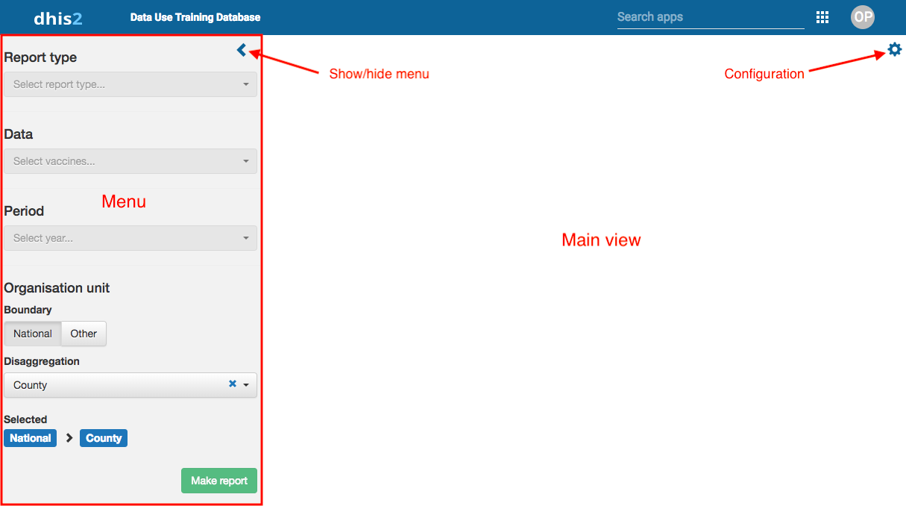

#### The Menu

The menu consists of 4 sections:

* Report type
* Data
* Period
* Organisation unit

The "Report type" is a drop-down list where the user chooses the type of report/visualisation to created. Based on the selected report type, the options for data, period and organisation units will change (or be hidden). Each report type is described below.

##### Organisation Unit

The organisation unit (orgunit) selection is by default based on the "user orgunit", i.e. the organisation unit the current user is assigned to in DHIS2. For example, for a district manager, this would be his/her district. To make a report for other organisation units, "Other" can be selected, which will present an orgunit tree with the organisation unit the current user has access to.

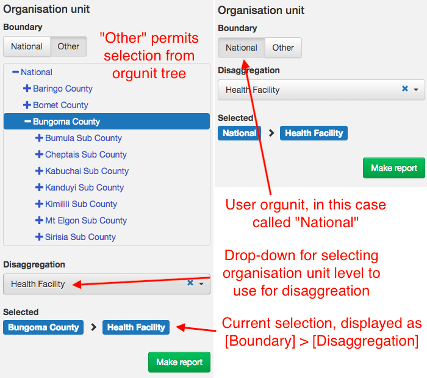

### Report type "Vaccines - doses and coverage"

"Vaccines - doses and coverage" is the first report type, and it produces a table with vaccines doses given (total and in the target age group, typically < 1 year) and vaccine coverage by month from January to December, with either monthly or cumulative values.

There are two sub-types for this report:

* Multiple vaccines for one orgunit
* One vaccine for multiple orgunits

As the name implies, the two subtypes change the available option for what vaccines and orgunits can be selected. In the first case, the Data section permits selecting multiple vaccines to be included in the report as additional rows, but only a single orgunit. *Note: the list of vaccines is configured by the administrators of the app, and are not identical to the data elements/indicators of DHIS2.*

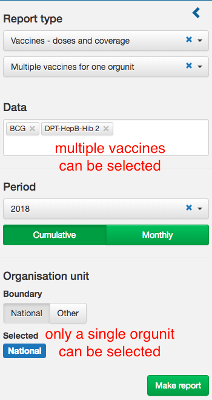

When the second sub-type is selected, the Data section only permits selection of a single vaccine, but multiple orgunits. Orgunits are selected by choosing a boundary, and an orgunit level to disaggregate by. For example, choosing "Region B" as the boundary and "District" as the level, all districts of Region B will appear as rows in the report.

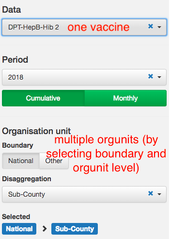

#### Period

The report always shows the months from January to December. The period section allows selecting the year to use for analysis, as well as choosing whether to show monthly values or cumulative values.

#### Download

The data can be downloaded as a CSV file using the "Download CSV" button.

### Report type "Performance report"

The second report type is "Performance - coverage vs dropout", which visualises the relationship between DPT 3 coverage and DPT 1-3 dropout rate in several ways. It is based on categorising orgunits into four categories (A, B, C, D) depending on their performance.

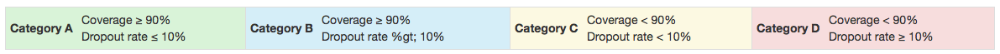

Only two parameters need to be chosen: the year and orgunit. For orgunits, a boundary and an orgunit level must be selected.

#### Scatterplot of coverage vs dropout

The first output is a scatterplot of coverage against dropout rate, with orgunits represented as dots. The four performance categories (see above) are highlighted on the chart as coloured boxes.

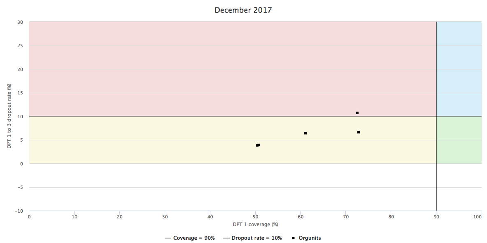

#### Summary of orgunits by month and orgunit

The second output is one or two tables (depending on orgunit selections). The first table shows the number of orgunits falling into each performance category by month. If there is an organisation unit level *between* the selected boundary orgunit and level chosen for disaggregation, a second table will show the number of orgunits falling into each performance category by the orgunits at the intermediary level. For example, if "Region C" is the boundary and "Sub-district" is the level of disaggregation, this table would show the number of sub-districts falling into each performance category by district.

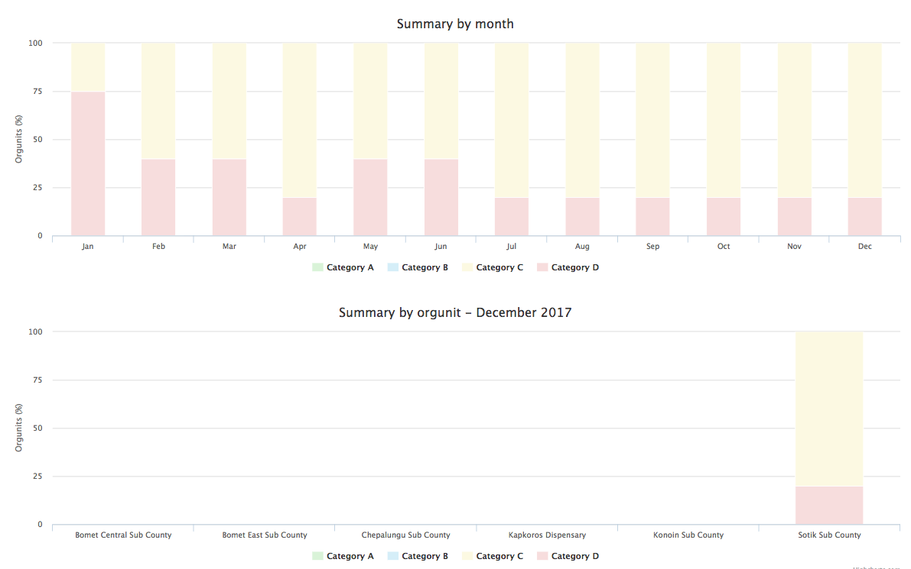

#### Performance by month

The final output is a table showing the performance category for each orgunit for each month from January to December.

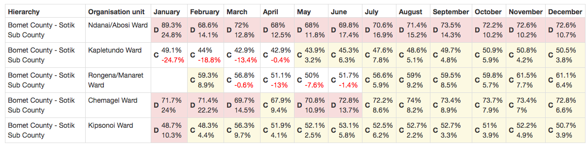

### Report type "Monitoring chart"

The "Monitoring chart" report type has two sub-types:

* Multiple vaccines for one year
* One vaccine for multiple years

As the name implies, the two subtypes change the available option for what vaccines and periods can be selected. In the first case, the Data section permits selecting multiple vaccines and one year, whilst in the second case only a single vaccines can be selected, but several years.

#### Multiple vaccines for one year

When the "Multiple vaccines for one year" sub-type has been selected, the  Data section shows two dropdown menus. The first permits selection of one or more vaccines to be included in the chart. The second permits selection of an age group, e.g., "children < 1 year" or "live births", which can be added to the monitoring chart as a target or reference. The available targets are based on which vaccines have been selected. A single period (year) and orgunit must be selected.

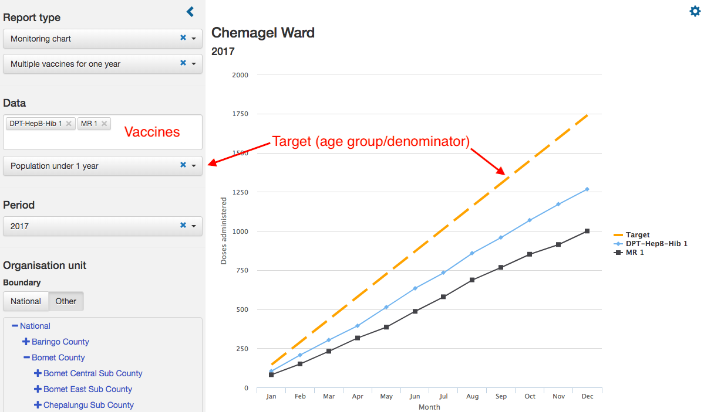

#### One vaccine for multiple years

When the "One vaccine for multiple years" sub-type has been selected, the  Data section shows only a single dropdown menu where one vaccine can be selected. In the period section, a period (year) and the number of previous periods (years) to include in the chart must be selected, as well as a single orgunit.

### Report type "RIM export"

This report type is only visible for users who have been given explicit access, by being added to a "RIM Export" user group which is created by the app when RIM export is configured. Only the Period section of the menu is used, to select a year and month to export data for. Making a report will trigger the download of a CSV-file. Note that this process can take up to several minutes.

## Installation and Configuration { #immunisation-analysis-app-installation-and-configuration }

This sections covers installation and configuration of the app and is intended for administrators. Installation can only be done by users with the authority to install DHSI2 apps ("App management"). Configuration can only be done by users with the authority to "Add/edit public indicators".

### Installation

The Immunisation analysis app can be downloaded from the [DHIS2 App Store](https://play.dhis2.org/appstore) and manually installed, or installed directly from the App Store throught the "App Management" app of DHIS2. 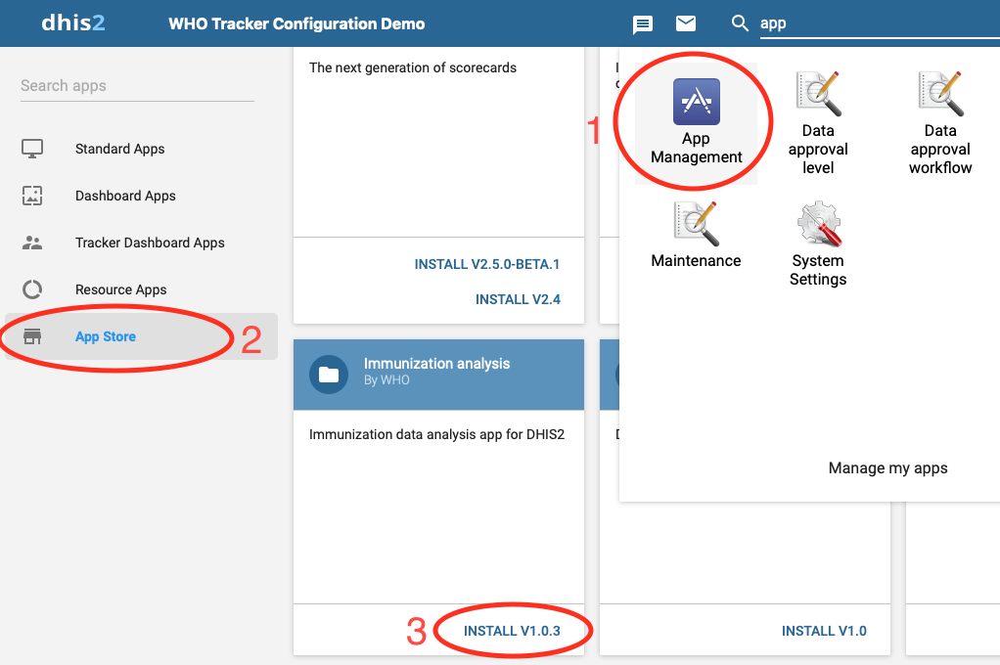.

### Configuration

The configuration of the app is accessed by clicking the gear icon in the top right of the app (see [Overview and navigation](#Overview-and-navigation) above).

The configuration part of the app has two tabs, "Vaccines" and "RIM". Only the "Vaccines" tab will be discussed here, whilst "RIM configuration" is described [below](#RIM-Export).

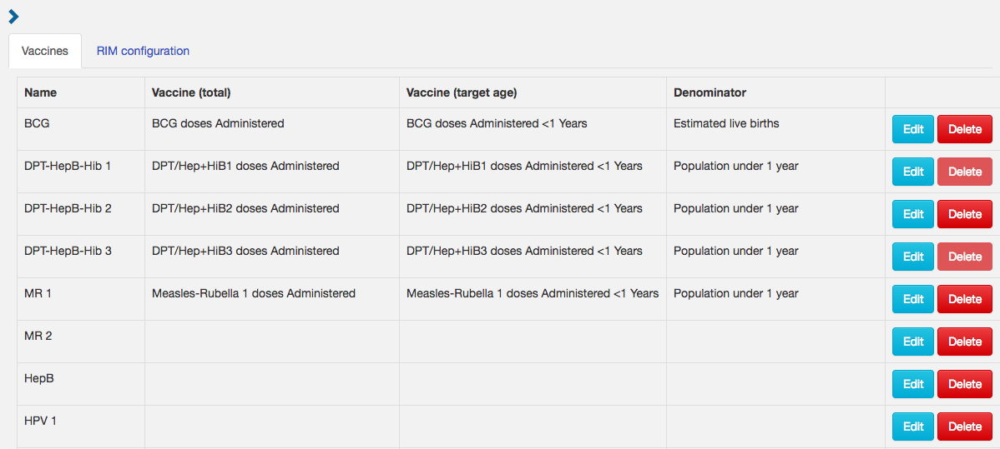

The functioning of the app is based on a mapping from data elements or indicators in a particular DHIS2 database to some standard variables. For each vaccine, 3 data elements or indicators must be specified:

* Doses administered (total) for the vaccine
* Doses administered in the target age group for the vaccine
* Denominator or target age group for the vaccine

The vaccines page consist of a table, with one vaccine/antigen per row. The "name" column is a name unique to the app, and a list of some standard vaccines are included. The "Vaccine (total)", "Vaccine (target age)" and "Denominator" columns shows the name of the DHIS2 data elements or indicators that each variable has been mapped to. Finally, there are "Edit" and "Delete" buttons for each row, for changing the configuration/mapping and deleting that vaccine respectively.

DPT 1 and DPT 3 can not be removed, as they are required for the "Performance report". Only vaccines that have been configured are visible and available in the main part of the app.

#### Configuring a vaccine

To configure a vaccine, click the Edit button. A new page will appear, with four main sections.

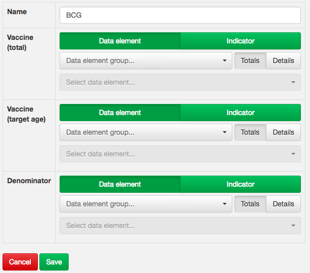

The name field specifies the name of the vaccine which will be used in the app. For each of the other fields, you must select the data element or indicator corresponding to:

* Doses administered (total) for the vaccine
* Doses administered in the target age group for the vaccine
* Denominator or target age group for the vaccine

If no data element is available for one particular variable, for example if only "OPV 1 < 1 year, male", "OPV < 1 year, female" are available, but not "OPV 1 < 1 year" (i.e. both sexes), an indicator must be creating that adds up male and female before the vaccine can be configured in the app.

Note: a limitation of the app is that existing configurations can not be edited, they have to be done from scratch.

Adding a vaccine is done in the same way, by clicking the "Add" button below the table. When adding a vaccine, the name must also be provided by the user.

## RIM Export { #rim-export }

The RIM Export functionality requires additional configuration, beyond what is described above for the overall configuration. In short, the process involves:

1. setting certain parameters about what variables are available
2. based on the parameters, importing a number of DHIS2 indicators
3. configuring the imported RIM indicators, to point them to the appropriate data elements
4. giving access to the users who should have access to the RIM Export functionality

Note that even though the RIM export involves importing a number of indicators in the DHIS2 database, these are *not* visible for regular users, only for users explicitly added to a particular user group. This is achieved using the DHIS2 sharing functionality.

To start the process of configuring RIM export, open the configuration page (only accessible for user with the "ALL" or "Add/edit public indicator" authorities) by clicking the gear icon in the top right of the app (see [Overview and navigation](#Overview_and_navigation) above). Click on the "RIM configuration" tab at the top of the page.

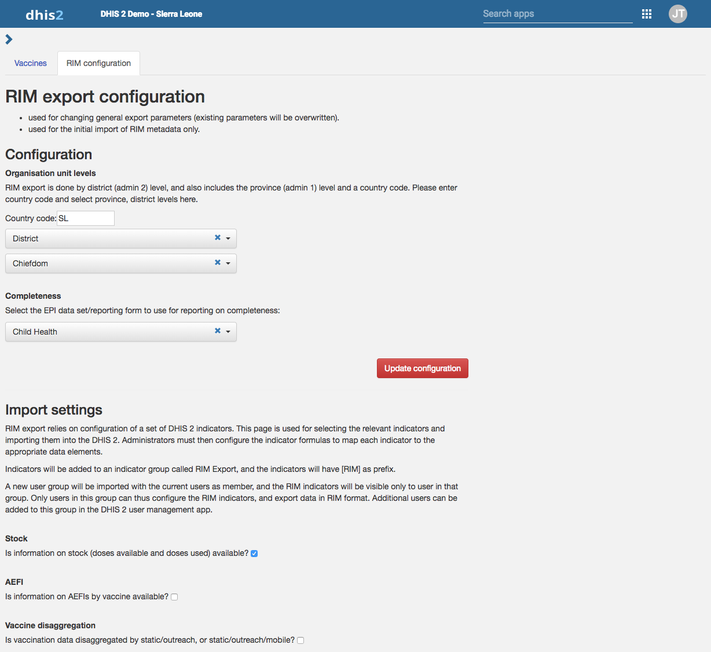

### Selecting overall parameters

The first part of the configuration requires specifying

* the country code
* which organisation units levels in DHIS2 to use for exporting (corresponding to admin1 and admin2)
* which data set to use for calculating data set completeness (expected and actual reports)

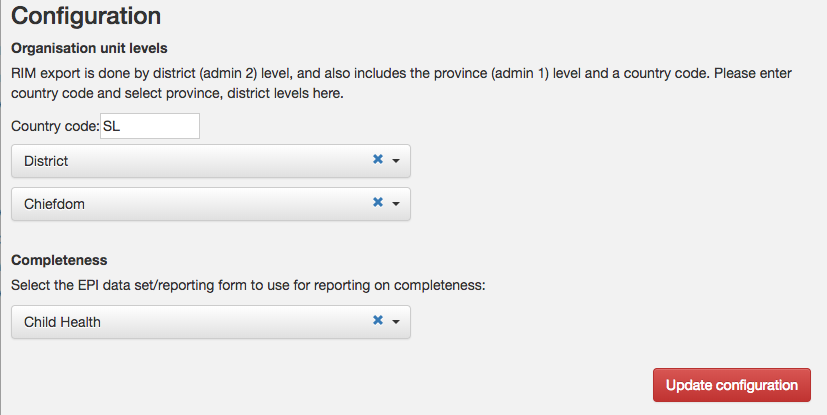

After providing the above information, click the "Update configuration" button to save the configuration. This is saved in the DHIS2 `dataStore`.

### Importing RIM indicators

The second part of the configuration page, under the "Import settings" heading, allows selecting/deselecting different variables, depending on what data is available in DHIS2. This determines what indicators will be imported into DHIS2, helping to avoid importing indicators which can not be configured because data is not available. Importantly, the specific vaccines/antigens included in the vaccine schedule should be selected.

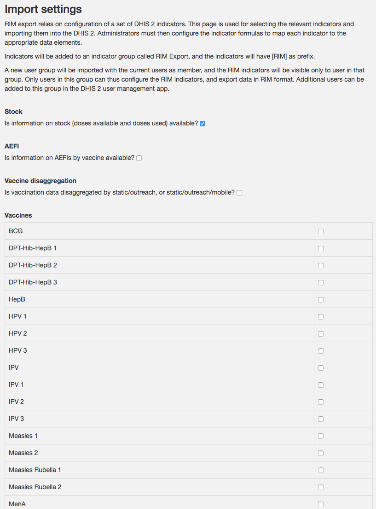

Once the appropriate selections have been made, clicking the "Import metadata and update configuration" button at the bottom of the page will import the placeholder indicators. A checkbox lets you overwrite previously imported indicators - this will reset any configurations made previously.

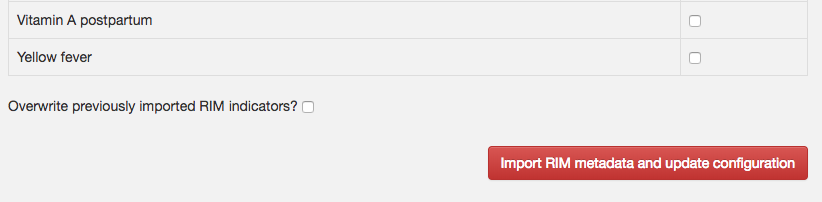

Once complete, a pop-up window will appear showing how many indicators was imported (or failed).

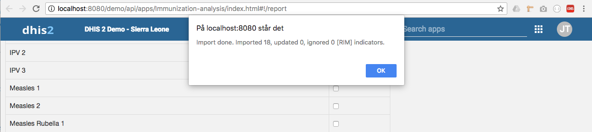

In addition to the indicators, a user group called "RIM Export" is created as part of the import ([see below](#Giving-access-to-perform-RIM-export)), and the indicators are only visible to users in that group (public sharing is disabled). The user performing the import is added to this group automatically.

### Configuring RIM indicators

The imported indicators all have a prefix "[RIM]" for easy identification. They will all return -1 until they have been configured. Configuring the indicators means changing the numerator expression to point to the appropriate data element(s).

![RIM indicators with [RIM] prefix after import into DHIS2](resources/images/IMM_ANSYS_rim_indicator_maintenance.png)

Each of the indicators prefixed [RIM] must be edited, with the numerator expression modified to point to the appropriate data elements.

### Giving access to perform RIM export

To give a user access to the RIM export report type of the app, add the user to the "RIM users" user group. The same applies for giving users access to configuring RIM indicators.

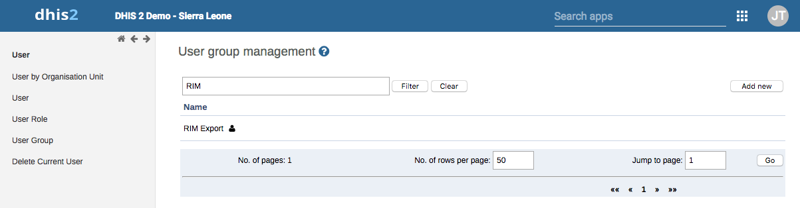

By default, the RIM Export user group itself is only visible to user in the group itself, which means that only members of the group can add additional users. This can be changed by changing the sharing settings of the RIM Export group itself. For example, it could be made visible to users in an "Immunisation manager" group (or similar), so that users working with immunisation data could add themselves.
