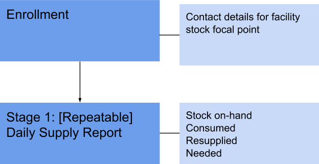
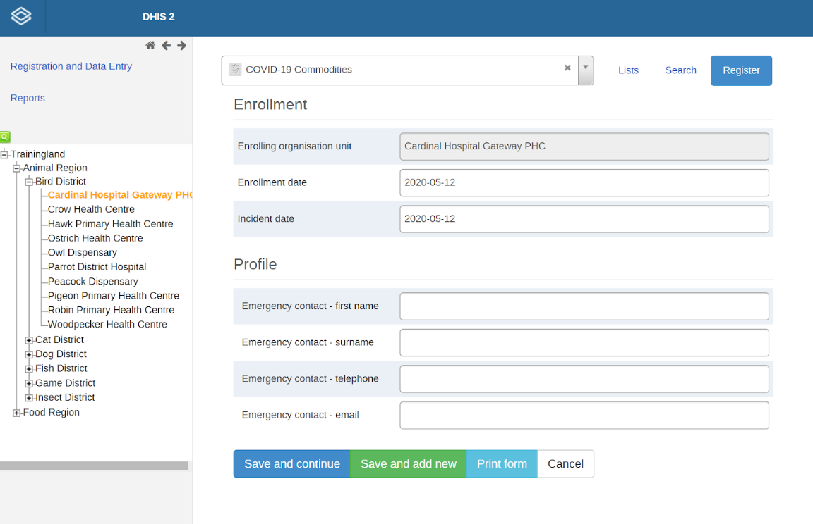
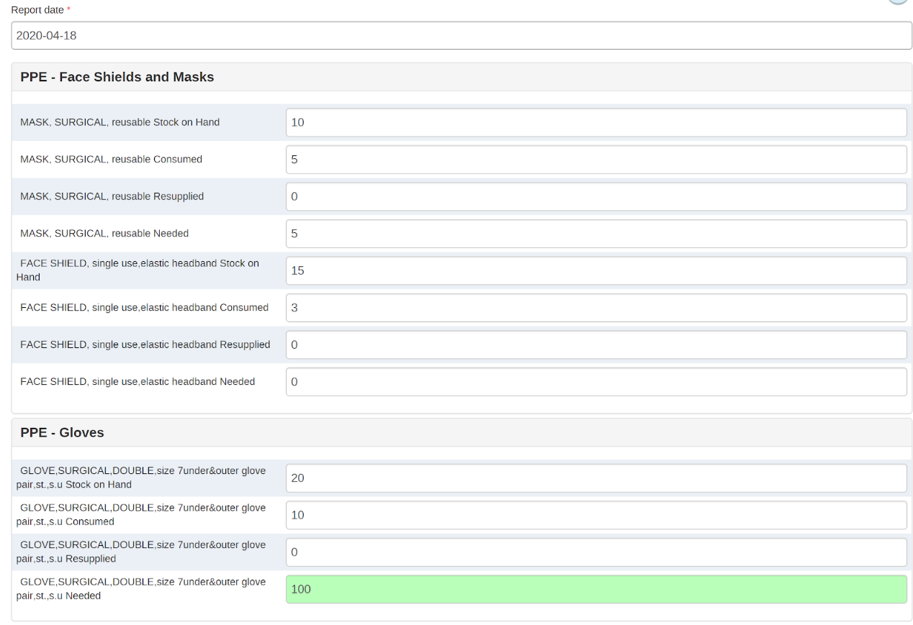

# **COVID-19 Commodities Tracker System Design v0.3.3**

* Last updated 27/03/2020

* Package version: 0.3.3

* DHIS2 Version compatibility 2.33.2

* Demo: [https://covid19.dhis2.org/](https://covid19.dhis2.org/)

## Purpose

The COVID-19 Commodities System Design document provides an overview of the conceptual design used to configure a tracker program and key indicators for tracking commodities related to COVID-19. This document is intended for use by DHIS2 implementers at country and regional level to be able to support implementation and localisation of the package. The COVID-19 metadata package can be adapted to local needs and national guidelines. In particular, local work flows and national guidelines should be considered in the localization and adoption of the programs included in this package.

## Background

The COVID-19 digital data package was developed in response to an expressed need from countries to rapidly adapt a solution for managing COVID-19 data. Monitoring commodities such as personal protective equipment and testing supplies at the lowest levels of the health system is critical. DHIS2 is not meant to replace existing functional logistics management information systems (LMIS). However, in some country contexts DHIS2 is used at the facility level and is capable of capturing basic commodities data that can be analyzed alongside case surveillance and service delivery data to improve response.

**The commodities tracker is designed based on the [WHO guidelines on rational use of Personal Protective Equipment for COVID-19 (19 March 2020)](https://www.who.int/publications-detail/rational-use-of-personal-protective-equipment-for-coronavirus-disease-(covid-19)-and-considerations-during-severe-shortages).** The design also draws on existing use cases where countries DHIS2 for capturing key stock data for commodities and medical equipment at the facility level. Note that this design may not necessarily reflect the latest available interim global guidance developed by WHO as updates may be released rapidly. National guidelines and policies may vary and it is recommended to adapt this package to local context.

## System Design Summary

Digital data packages are optimized for Android data collection with the DHIS2 Capture App, free to download on the [Google Play store](https://play.google.com/store/apps/details?id=com.dhis2&hl=en).

In the development of this configuration package, an effort has been made to follow UiO’s [general design principles](https://who.dhis2.org/documentation/general_design_principles.html) and a common [naming convention](https://who.dhis2.org/documentation/naming_convention.html).

## Why tracker?

While some countries use an aggregate data set for stock reporting from facilities, the Tracker data model gives us greater analytical power. In this design, the Tracked Entity Type is ‘Commodity’. The COVID-19 Commodities Tracker is ***not intended to track a specific commodity through the supply chain;*** rather, we use the Tracker data model for capturing key commodity data values at the facility level.

Benefits for Using tracker with stock management

1. You can use program indicators/rules instead of using predictors.  Making the calculations easier to configure, and will be more real time and increase performance.
2. You will have everything in one app
3. You will have the possibility to get to patient level data
4. Easier to cross time periods
5. The system will auto calculate emergency resupplies
6. Lead Time (lead time from stock out to resupply. Number of days between 0 recorded and resupply. _See it in a dashboard_)

## Intended users

* Health facility users: capture and record stock counts (# of commodities on-hand, consumed, re-supplied); make requests for commodity re-supply as needed
* District health departments and district warehouses: monitor stock levels across facilities to distribute key commodities effectively
* National and local emergency response planners: analyze commodity data alongside surveillance data to develop resource mobilization and distribution plans for key commodities needed for COVID-19 response

## Workflow: COVID-19 Commodities

1. Data entry staff at facility level records stock on-hand and stock consumed daily (or more often as needed)
       1.  If a commodity is needed, the data entry staff records the number of the commodity needed
2. At District level (e.g. warehouse, health department), stock levels are monitored daily. Requests for commodities can be viewed daily on the dashboard to identify facilities that require re-supply of any key commodity
3. District-level staff responsible for medical commodities distribution contacts the Facility and schedules delivery of re-supply
4. Re-supplied commodities recorded in the DHIS2 Commodities module

## Structure: COVID-19 Commodities

### Program Description: COVID-19 Commodities

|Stage|Description|
|--- |---|
|Enrollment details| The TEI that is enrolled is the stock focal point at facility level, including attributes for contact details. This facilitates generation of working lists at higher levels (i.e. district) for re-supply of commodities.    Enrollment date = Date when contact person is assigned & registered into the system. Note we do not use Enrollments for program indicators; but the contact details of the TEI can be exposed in Event Reports.|
|Attributes| Attributes include basic contact information for the facility’s stock management focal point: *First Name, Surname, Telephone and Email.*
|Stage 1: Daily Supply Report (Repeatable)|**PPE - Faceshields and Masks**: *Stock on hand, Consumedm, Resupplied, Needed*  **PPE - Gloves**: *Stock on hand, Consumed, Resupplied, Needed*  **PPE - Gowns & Aprons**: *Stock on hand, Consumed, Resupplied, Needed*  **Disinfectant**: *Stock on hand, Consumed, Resupplied, Needed*  **Thermometers**: *Stock on hand, Consumed, Resupplied, Needed*  **TBD: add Treatment Supplies, Testing Supplies?**|

### Enrollment

In this design, only one TEI needs to be enrolled into the program and can be re-used throughout. The TEI should be registered as the main point of contact for facility commodities with contact details such as telephone number. Additional attributes can be added for country customization as needed or may include primary and secondary contact details in the same registration.

### Program Stage: Daily Supply Report

The Daily Supply Report is intended for daily stock reporting. Four data elements capturing quantities for each type of commodity enable additional indicators for analysis described in [Program Indicators](#program-indicators).

#### Data Elements

A number of data elements for key commodities has been configured; a country may customize by adding data elements for the commodities they wish to track and remove any that are not relevant to their context. For each commodity type (i.e. surgical gown, face shield, surgical mask, ear thermometer, etc.) there are four data elements which are captured as numerical values (type = zero or positive integer):

1. Stock on hand -- record the current amount of stock on hand
2. Consumed -- record the amount of stock consumed in the daily reporting period
3. Re-supply -- record the amount of stock re-supplied (received) for a given commodity type during the daily reporting period
4. Needed -- staff can record the quantity/amount of a commodity that they need (i.e. that they are requesting)

The commodity types currently included in the package are:

* APRON, plastic, min. 130cm long, s.u.
* CHLORHEXIDINE DIGLUCONATE 5%, solution, 1L, btl.
* (ear thermomether electronic)EAR TIP COVER
* FACE SHIELD, single use,elastic headband
* GEL for hand disinfection without water, 475ml
* GLOVE,SURGICAL,DOUBLE,size 7under&outer glove pair,st.,s.u.
* GOWN, SURGICAL, size L, disposable, sterile
* MASK, SURGICAL, reusable
* SOLUTION for hand disinfectionwithout water,& pump 500ml
* THERMOMETER, Ear Thermometer,electronic

***These commodities are based on a standard emergency commodities list provided by ICRC; data elements should be re-named, added and deleted according to commodity types used within the country.***

## Program Rules

The following program rules have been configured.

## Program Indicators

From the data elements captured in the Daily Supply Report, the following indicators are calculated for stock monitoring

### Key Logistics Indicator Definitions

|Name|Description|Config Status|
|--- |--- |--- |
|Stock Received|Stocks received from a resupply or stock transfer *the same as the DE|Anything needed?|
|Stock consumption|The same as the DE|Anything needed?|
|Stock wasted|??? I don’t think we get this in this config||
|Opening balance|Opening balance for day or shift||
|Closing balance|Closing balance for end of the shift||
|Stock on hand|Same as DE Stock on hand|Anything needed?|
|Stock out Days|The number of days stocked out of any commodity. This assumes daily reporting. Number of stockouts [by commodity, by facility] in a given range of time If zero is entered for this DE, record a ‘1’ for stockout. COUNTIF value = 0|Masks done, needs testing
|Drug availability rate|Facilities with stock/All facilities Numerator: Facilities with X commodity in Stock >= 0 Denominator: All Facilities reported anything (if value = true)|Masks Done, needs testing|
|Stock status - overstock|Stock on hand for a given commodity is greater than 45 day average consumption.+25%Event period boundaries? Returns a binary 1/0|
Stock status - adequate|Stock on hand for a given commodity is less than 45 day average consumption +25% and greater than 30 day average consumption - 25% Returns a binary 1/0|
Stock status - understock|Stock on hand is less than 30 day average consumption. -25% Returns a binary 1/0|
|Stock status - stock out|DE ‘stock on hand’ has zero value (latest reported stock on hand = 0). Only analyze at facility level.|Masks Done, needs testing|
|Average consumption|The three month daily average of commodity consumption which also factors in periods of stockout (Average of DE ‘consumption’ filter value !=0?)|

**Add some PIs for the stocks ‘needed’?**

## Analytic Outputs

* Line listing current stock-outs and total number of stock-outs over time- At any given time users must be able to line list and view on a map any current stockouts and monitor the number of stockouts over time.
* Line listing can include the contact details of the facility contact/stock management focal point since these are captured as TEI attributes

## References

* Installation guidance: [https://www.dhis2.org/covid-19](https://www.dhis2.org/covid-19)
* [WHO guidelines on rational use of Personal Protective Equipment for COVID-19](https://www.who.int/publications-detail/rational-use-of-personal-protective-equipment-for-coronavirus-disease-(covid-19)-and-considerations-during-severe-shortages)
