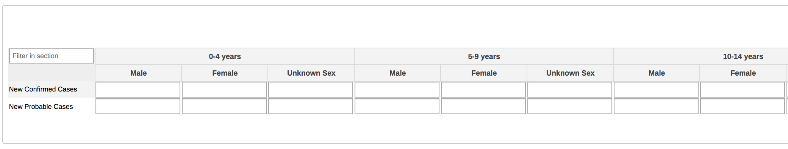
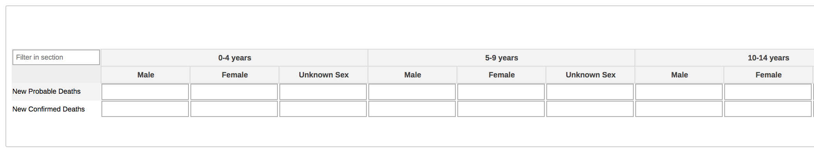
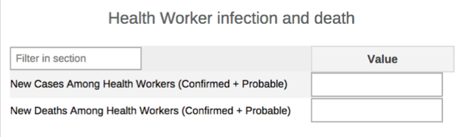
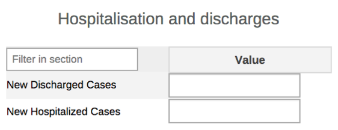
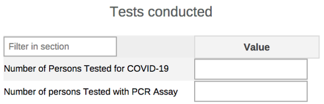
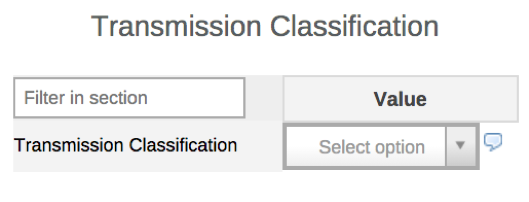

# COVID-19 Surveillance - Aggregate System Design Guide

Last updated 12/10/2020

Package Version 2.0

DHIS2 Version compatibility 2.30 - 2.34

Demo: [https://covid.dhis2.org/](https://covid.dhis2.org/)

## Purpose

The COVID-19 Surveillance Aggregate System Design document provides an overview of the design principles and guidance used to develop the digital data package for aggregate COVID-19 surveillance. This document is intended for use by DHIS2 implementers at country and regional level to be able to support implementation and localisation of the package. The COVID-19 metadata package can be adapted to local needs and national guidelines. In particular, local work flows and national guidelines should be considered in the localization and adoption of the programs included in this package.

## Background

This aggregate design has been updated to reflect new aggregate reporting requirements from the [Global surveillance of COVID-19: WHO process for reporting aggregated data](https://www.who.int/publications/i/item/aggregated-weekly-reporting-form), last updated on August 7, 2020. The COVID-19 digital data package was developed in response to an expressed need from countries to rapidly adapt a solution for managing COVID-19 data. UiO has developed COVID-19 surveillance packages for three types of data models (tracker, event-based aggregate) to enable countries to select the model that is most appropriate for their context given the burden of disease and available resources. These models and their relative benefits/limitations are summarized below:

| **Type of Surveillance Package** | **Case-based Surveillance (Tracker)** | **Case surveillance line-listing (Event)** | **Case surveillance (Aggregate)** |
| --- | --- | --- | --- |
| **Description** | Enrolls a case and tracks over time through laboratory confirmation &amp; case outcome | Captures critical case details in line-listing format | Enables weekly reporting of key aggregate data points |
| **Pros** | Highly granular data and multiple time dimensions for analysis, can support decentralized workflow, all events linked to the case | More granular than aggregate and can capture key time dimensions (i.e. report date vs onset of symptoms); reduced burden of data entry compared to tracker and little complexity | Low complexity, easy to implement, most manageable when cases numbers are high |
| **Cons** | Burden of data entry may be overwhelming when number of cases reach threshold; complexity of implementation | Does not support case-follow up or other decentralized workflows | Less granularity for detailed analysis (i.e. analysis only based on case reporting date, limited disaggregation)|

**This document covers only the design of the aggregate package**; separate system design documents are available for DHIS2 Tracker and Line-listing (event-based) packages. As cases increase rapidly, some countries may struggle with case-based reporting as the burden becomes too high. The aggregate package is designed to meet the most critical reporting requirements and analytical capacities for surveillance and response.

The objectives of COVID-19 surveillance are:

1. to monitor trends of the disease where human to human transmission occurs;
2. rapidly detect new cases in countries where the virus is not circulating;
3. provide epidemiological information to conduct risk assessments at the national, regional and global level; and
4. provide epidemiological information to guide preparedness and response measures.

The system design builds upon existing disease surveillance principles and information system requirements that have been developed collaboratively between the WHO and UiO since 2017. The COVID-19 package was developed with the intent to align to [WHO technical guidance on nCoV-19 surveillance and case definitions](https://www.who.int/emergencies/diseases/novel-coronavirus-2019/technical-guidance/surveillance-and-case-definitions), last updated August 7, 2020. Note that this design may not necessarily reflect the latest available interim global guidance developed by WHO as updates may be released rapidly. National guidelines and policies may vary and it is recommended to adapt this package to local context.

## System Design Summary

In the development of this configuration package, an effort has been made to follow UiO&#39;s [general design principles](https://who.dhis2.org/documentation/general_design_principles.html) and a common [naming convention](https://who.dhis2.org/documentation/naming_convention.html).

The aggregate COVID-19 surveillance package includes

1. Weekly aggregate data set and data elements for key COVID-19 surveillance reporting
2. Categories for data disaggregation
3. Core indicators
4. Dashboard and its items

The dataset captures a minimum number of data points that meet the current WHO weekly reporting requirements; and generate a core set of indicators and dashboards for national and sub-national decision-makers to rapidly analyze and respond to disease trends.

| **Name** | **Periodicity** | **Purpose** |
| --- | --- | --- |
| COVID-19 Surveillance Report | Weekly| Reporting of key COVID-19 surveillance data including cases, tests and deaths. |

It is recommended that the weekly dataset is assigned to Organisation Units at the lowest level of the health system feasible for reporting data, such as health facilities.

Digital data packages are optimized for Android data collection with the DHIS2 Capture App, free to download on the [GooglePlay store](https://play.google.com/store/apps/details?id=com.dhis2&amp;hl=en).

### Intended users

- Health facility users: capture and report key data on COVID-19 cases and deaths presenting at the health facility
- Surveillance officers: surveillance officers at national and sub-national level may be responsible for supporting data entry and analysis.
- National and local health authorities: monitor and analyse disease surveillance data through dashboards and analytics tools to conduct risk assessments and plan response measures; generate reports for regional and global reporting

## Datasets

This dataset is intended to capture weekly data needed for rapid response to disease transmission. If the burden of reporting becomes too great or when it is no longer considered an emergency situation in the country, the data set may be changed to monthly according to MOH policies.

### Daily Surveillance Data Elements

The following lists the data elements and disaggregation (category combinations) included in the data set:

| **Data Elements** | **Category Combinations** |
| --- | --- |
| New Confirmed Cases | Gender (Male/Female/Unknown) and Age (0-4,5-9,10-14,15-19,20-29,30-39,40-49,50-59,60-64,65-69,70-74,75-79,80+,Unknown age) |
| New Probable Cases | Gender (Male/Female/Unknown) and Age (0-4,5-9,10-14,15-19,20-29,30-39,40-49,50-59,60-64,65-69,70-74,75-79,80+,Unknown age) |
| New Confirmed Deaths | Gender (Male/Female/Unknown) and Age (0-4,5-9,10-14,15-19,20-29,30-39,40-49,50-59,60-64,65-69,70-74,75-79,80+,Unknown age) |
| New Probable Deaths | Gender (Male/Female/Unknown) and Age (0-4,5-9,10-14,15-19,20-29,30-39,40-49,50-59,60-64,65-69,70-74,75-79,80+,Unknown age) |
| New Hospitalized Cases | None |
| New Discharged Cases | None |
| New Cases Among Health Workers (Confirmed + Probable) | None |
| New Deaths Among Health Workers (Confirmed + Probable) | None |
| Number of Persons Tested for COVID-19 | None |
| Number of persons Tested with PCR Assay | None |
| Transmission Classification | None |

### Weekly Surveillance Data Entry Form

- **Section 1: New confirmed and probable Cases**

Data should be entered for all new confirmed and probable cases reported during the reporting period. Confirmed cases refer to laboratory confirmed cases per WHO guidance; probable cases are defined by WHO as cases where laboratory test result is inconclusive; however countries may apply their own case definitions. The total column is automatically summed during data entry.

- **Section 2: New confirmed and probable deaths**

Data should be entered for new confirmed and probable deaths reported during the reporting period. The total column is automatically summed during data entry.

- **Section 3: Health worker infection and death**

This section captures data for health workers&#39; new confirmed and probable cases including deaths reported during the reporting period.

- **Section 4: Hospitalisation and discharges**

This section captures data for new hospitalisation and discharges during the reporting period.

- **Section 5: Tests conducted**

This section captures data for tests conducted with additional requirement to report tests conducted using PCR during the reporting period

- **Section 6: Transmission Classification**

This section summarizes the major form of transmission classification experienced by the reporting unit.

### Customizing Data Entry Forms

The dataset in this package does not contain a custom form. To improve the usability of the form for data entry, implementers may design a custom form to meet their needs by following the DHIS2 User manual: [https://docs.dhis2.org/2.33/en/user/html/dhis2\_user\_manual\_en\_full.html#manage\_customform](https://docs.dhis2.org/2.33/en/user/html/dhis2_user_manual_en_full.html#manage_customform)

## Data Validation

The following data validation rules have been configured. These validation rules do not run in the data entry form itself as it is anticipated that the urgent reporting of data where events occur in different time frames (e.g. one week can see only 3 new cases but 5 deaths).

| **Name** | **Operator** | **Instruction** | **Left side description** | **Right side description** |
| --- | --- | --- | --- | --- |
| COVID19 - PCR tests \&lt;= tested | less\_than\_or\_equal\_to | Tested with PCR should be less than or equal to total tests conducted | Tested with PCR | Tested conducted |
| COVID19 - New Cases hospitalised \&lt;= All New Cases | less\_than\_or\_equal\_to | New Cases hospitalised should be less than or equal to all new cases | New Cases hospitalised | All New Cases |
| COVID19 - New confirmed deaths \&lt;= New confirmed cases | less\_than\_or\_equal\_to | New confirmed deaths should be less than or equal to New confirmed cases | New confirmed deaths | New confirmed cases |
| COVID19 - Probable deaths \&lt;= New probable cases | less\_than\_or\_equal\_to | Probable deaths should be less than or equal to New probable cases | Probable deaths | New probable cases |
| COVID19 - New deaths among HW (confirmed + probable) \&lt;= All deaths reported | less\_than\_or\_equal\_to | New deaths among HW (confirmed + probable) should be less than or equal to All deaths reported | New deaths among HW (confirmed + probable) | All deaths reported |
| COVID19 - New cases among HW (confirmed + probable) \&lt;= All new cases | less\_than\_or\_equal\_to | New cases among HW (confirmed + probable) should be less than or equal to All new cases | New cases among HW (confirmed + probable) | All new cases |
| COVID19 - New deaths among HW (confirmed + probable) \&lt;= new cases among HW (confirmed + probable) | less\_than\_or\_equal\_to | New deaths among HW (confirmed + probable) should be less than or equal to new cases among HW (confirmed + probable) | New deaths among HW (confirmed + probable) | New cases among HW (confirmed + probable) |

## User Groups

The following user groups are included in the metadata package:

1. COVID19 admin -- intended for system admins to have metadata edit rights
2. COVID19 data capture -- intended for data entry staff to have access to capture data
3. COVID19 access -- intended for users such as analytics users who should be able to view the data, but not edit metadata.

Please refer to the [installation guidance](https://www.dhis2.org/covid-19) for more information.

## Indicators

From the data captured, we can calculate at least the following indicators, many of which are recommended by the WHO for [weekly reporting](https://apps.who.int/iris/bitstream/handle/10665/331506/WHO-2019-nCoV-SurveillanceGuidance-2020.6-eng.pdf) and present them in a dashboard. All COVID-19 program indicators are assigned to the Indicator Group &#39;COVID19&#39;.

| **name** | **description** |
| --- | --- |
| COVID19 - New Confirmed Deaths | Number of new confirmed deaths |
| COVID19 - New Cases Among HW (Confirmed + Probable) | Number of New Cases Among HW (Confirmed + Probable) |
| COVID19 - Proportion of HW amongst reported cases (%) | Proportion of HW amongst reported cases (%) |
| COVID19 - Active cases | Number of of active cases |
| COVID19 - Closed cases | Number of closed cases |
| COVID19 - New Confirmed cases | Number of new Confirmed cases |
| COVID19 - Recovery rate (%) | Recovery rate of confirmed cases |
| COVID19 - Case fatality rate among HW (%) | Case fatality rate among HW |
| COVID19 - New Hospitalized Cases | New Hospitalized Cases |
| COVID19 - Tested | Total number of tests conducted |
| COVID19 - Tested with PCR Assay | Tested with PCR assay |
| COVID19 - Positivity rate (%) | Positivity rate |
| COVID19 - New Probable Cases | Number of new probable cases |
| COVID19 - New Discharged Cases | Number of new discharged cases |
| COVID19 - New Deaths Among HW (Confirmed + Probable) | Number of new deaths among HW (Confirmed + Probable) |
| COVID19 - Proportion of PCR tests (%) | Proportion of PCR tests conducted |
| COVID19 - All cases (Confirmed + Probable) | Number of all cases (Confirmed + Probable) |
| COVID19 - New Probable Deaths | Number of new probable deaths |
| COVID19 - Case fatality rate (%) | Case fatality rate among confirmed cases |

## Dashboards

Key analytic items have been configured and added onto the dashboard “COVID19 - Aggregate Weekly Surveillance”. These items include; pivot tables, charts and a map designed to provide data visualization for some of the data captured based on the indicators. In the process of adopting this package, users can modify or create additional items as suits their analytical needs and equally make the necessary adjustments to the dashboard.

| **name**|**type**|
| --- | --- |
|COVID19 - Tested, tests with PCR and positivity rate by subnational level this year |Pivot table|
|COVID19 - HW amongst reported cases this year |Chart|
|COVID19 - Fatality rate amongst HW.|Chart|
|COVID19 - New confirmed cases and deaths in the last 12 weeks|Chart|
|COVID19 - Cumulative tests conducted, cases reported, hospitalised, discharged and deaths|Chart|
|COVID19 - Cumulative confirmed cases by subnational|Map|
|COVID19 - Deaths by age groups last weeks|Chart|
|COVID19 - Confirmed cases by sex in the last 14 weeks|Chart|
|COVID19 - Closed and active cases at subnational last months|Chart|
|COVID19 - Case recovery and fatality rates last 12 weeks|Chart|
|COVID19 - Active and Closed Cases last 12 weeks|Chart|

## References

- Installation guidance: [https://www.dhis2.org/covid-19](https://www.dhis2.org/covid-19)
- WHO Interim guidelines on nCoV-19 surveillance & case definitions (last updated March 20, 2020)
[https://www.who.int/emergencies/diseases/novel-coronavirus-2019/technical-guidance/surveillance-and-case-definitions>](<https://www.who.int/emergencies/diseases/novel-coronavirus-2019/technical-guidance/surveillance-and-case-definitions>)
- WHO COVID-19 surveillance data dictionary (v6)
[https://www.who.int/docs/default-source/coronaviruse/data-dictionary-covid-crf-v6.xlsx?sfvrsn=a7d4ef98\_2](https://www.who.int/docs/default-source/coronaviruse/data-dictionary-covid-crf-v6.xlsx?sfvrsn=a7d4ef98_2)
- WHO Laboratory testing for 2019 novel coronavirus (2019-nCoV) in suspected human cases (last updated 2 March 2020)
  [https://www.who.int/publications-detail/laboratory-testing-for-2019-novel-coronavirus-in-suspected-human-cases-20200117](https://www.who.int/publications-detail/laboratory-testing-for-2019-novel-coronavirus-in-suspected-human-cases-20200117)
- WHO Coronavirus situation reports
  [https://www.who.int/emergencies/diseases/novel-coronavirus-2019/situation-reports>](<https://www.who.int/emergencies/diseases/novel-coronavirus-2019/situation-reports>)
- Global surveillance of COVID-19: WHO process for reporting aggregated data
[https://www.who.int/publications/i/item/aggregated-weekly-reporting-form](https://www.who.int/publications/i/item/aggregated-weekly-reporting-form)
