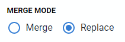

# Upgrade Notes

> ***NOTE***: This document is only for those who are installing the new version (v0.3.x) of the indicated package over the previous version (v0.2/v0.1). Please see the full installation instructions if you are installing on a new instance.
>
> Full installation instructions:
>
> [Case based surveillance & contact tracing](tracker-packages-installation-guide.html)
>
>[Surveillance Event Program](event-package-installation-guide-v032.html)
>
> [Aggregate Surveillance Reporting](aggregate-package-installation-guide.html)

## Case-Based Surveillance & Contact Tracing Package, Surveillance Event Program

You can install these packages (v0.3.3/v.0.3.2) directly on top of the previously existing package. This should be done in a testing/development environment as always.

1. Rename the current “percentage” indicator type (for example [delete] - Percentage)
2. Import the new packages in the following order if installing multiple packages
    1. Case based surveillance: + Contact Tracing Registration & Follow-Up : v0.3.3 are included in one package
    2. Surveillance Event Program : v0.3.2
3. Delete the percentage indicator type that you have renamed

If you are only installing one of the packages and not both, than you may import the single package after renaming the indicator than proceed to delete the previous indicator type after it has been imported.

This is to take care of aligning the indicator ID types across the aggregate and tracker packages.

## Aggregate Surveillance Reporting

You can install this package (v0.3.2) directly on top of the previously existing package (v0.1). This should be done in a testing/development environment as always.

1. When importing this package, use a merge mode of “Replace” rather than “Merge.” Merge is the default mode so you will have to change it when you import, or set this if you are importing through the API.

1. After you have imported this package, perform the following:
    1. Access the Data Administration App
    2. Go to “Maintenance”
    3. Select “Clear application cache” and “Reload apps”
    4. Select “Perform maintenance”
