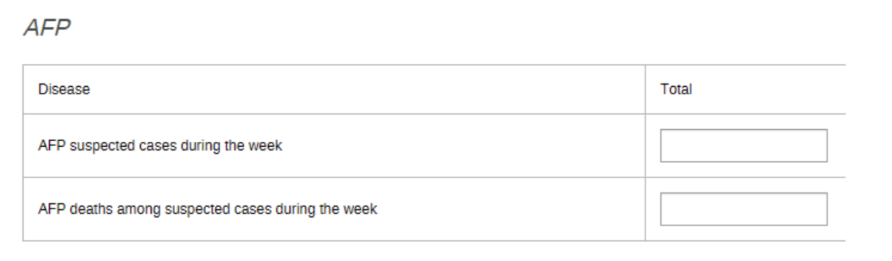
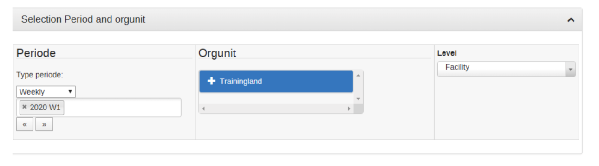
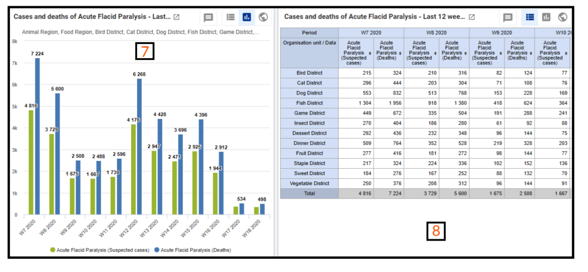
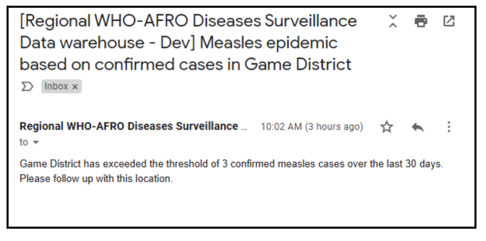

# Disease surveillance aggregate system design

Draft version, last updated 2020-05-29

## Introduction

This document describes the system design for the aggregate disease surveillance digital data package. This includes the following:

1. Disease Covered in the Package
2. Data Sets
3. Data Exchange Mechanisms
4. Dashboards
5. Validation Rules and Notifications

The aggregate surveillance package meta-data is provided in several different configurations to show countries possibilities for configuration and to reduce conflicts when performing data exchange. This also allows countries to select the configuration options that are most relevant to their context.

## Diseases Covered

The diseases covered in this package are outlined in [Table 1](#table-1)

### Table 1

Diseases in the vaccine preventable disease surveillance package

| Acute Flaccid Paralysis | Acute Watery Diarrhoea  | Cholera      | Dengue Fever |
| ----------------------- | ----------------------- | ------------ | ------------ |
| Diarrhoea with Blood    | Diptheria               | Measles      | Meningitis   |
| Neonatal Tetanus        | Non Neonatal Tetanus    | Pertussis    | Rabies       |
| Rubella                 | Viral Hemorrhagic Fever | Yellow Fever |              |

## Data Set Overview

The surveillance configuration package for aggregate reporting contains 6 datasets described in [Table 1](#table-1). Note that the datasets contain the same data elements for their reporting areas; however have copies that are both disaggregated and not disaggregated or divided into smaller sections depending on country design in order to be compatible with the importing of data into DHIS2. The disaggregated data sets are the ideal configuration that countries can move toward, while the non-disaggregated data sets may be what countries have in practice currently.

| **Name**                                                     | **Periodicity** | **Purpose**                                                  |
| ------------------------------------------------------------ | --------------- | ------------------------------------------------------------ |
| IDSR - Report: Suspected, Confirmed, Death                   | Weekly          | Reporting of surveillance activities: suspected cases, confirmed cases and deaths. This data is disaggregated. |
| IDSR - Report: Suspected, Confirmed, Death (no disaggregations) | Weekly          | Reporting of surveillance activities: suspected cases, confirmed cases and deaths. This data set is not disaggregated. |
| IDSR - Report: Suspected, Death                              | Weekly          | Reporting of surveillance activities: suspected cases deaths. This data is disaggregated. |
| IDSR - Report: Suspected, Death (no disaggregations)         | Weekly          | Reporting of surveillance activities: suspected cases deaths. This data is not disaggregated. |
| IDSR - Aggregate Lab Weekly Report                           | Weekly          | Reporting of confirmed cases directly from labs. This data is not disaggregated. |
| Population Weekly                                            | Weekly          | Weekly population data used for alerts. It is weekly as the DHIS2 predictor function is used to generate thresholds and currently can not combine data of different periodicity (in this case, weekly surveillance data with annual population data). |

### IDSR - Report: Suspected, Confirmed, Death

The _**IDSR - Report: Suspected, Confirmed, Death**_ dataset contains information on suspected cases, confirmed cases and deaths on the diseases outlined in [Table 1](#table-1). A number of the diseases have _**disaggregated**_ suspected cases and deathsand the form and uses a _**custom form design**_. The custom form design is a result of combining disaggregated and non-disaggregated data elements that belong to the same disease and require to be grouped together.

Disaggregations have been applied using the category model within DHIS2. This model has 2 key advantages when using disaggregations:

- It reduces the number of unique data elements that need to be made.
- In analysis, this allows for quick addition of the age breakdowns that can pivot as required. We can also see that the totals are quite useful to determine the total number related to a particular variable or period.

The disaggregated dataset has been identified as the ideal configuration as

### IDSR - Report: Suspected, Confirmed, Death (no disaggregations)

This dataset contains all of the _**exact same data elements**_ as the _**IDSR - Report: Suspected, Confirmed, Death**_ dataset; however it _**does not contain any disaggregations**_. The data elements in this dataset use the _**category combination override**_ function in DHIS2 to allow for data elements to be associated with multiple disaggregations based on the data set they are associated with. This is a _**section based**_ dataset as no custom form was required.

The main purpose of this dataset was to more easily allow compatibility with country systems that are importing data into the regional WHO AFRO disease surveillance data warehouse. This dataset will allow countries that do not have disaggregations to more easily import their data into the regional warehouse.

### IDSR - Report: Suspected, Death

The _**IDSR - Report: Suspected, Death**_ dataset contains information on suspected cases and deaths on the diseases outlined in [Table 1](#table-1). Note that it does not contain information on confirmed cases. This was done in the event the lab confirmation was a separate process and and therefore links to the IDSR - Aggregate Lab Weekly Report in the event that cases are confirmed using a separate process. This form uses the same data elements and structure contained in the IDSR - Aggregate Weekly Report dataset for cases and deaths. The custom form design from this dataset was therefore re-used such that a uniform design would be applied between this dataset and the IDSR - Aggregate Weekly Report dataset.

### IDSR - Report: Suspected, Death (no disaggregations)

The _**IDSR - Report: Suspected, Death (no disaggregations)**_ dataset contains information on suspected cases and deaths for the diseases outlined in [Table 1](#table-1). Note that it _**does not contain information on confirmed cases**_. It contains all of the same variables as the _**IDSR - Aggregate Weekly Report (Suspected - Death)**_ data set. This was done in the event the lab confirmation was a separate process and therefore links to the _**IDSR - Aggregate Lab Weekly Report**_ in the event that cases are confirmed using a separate process. This form uses the same data elements and structure contained on the _ **IDSR - Report: Suspected, Confirmed, Death** __**(no disaggregations)**_ dataset for cases and deaths. It uses a _ **section based design** _ as this is easier to maintain and translate over time and no custom form is needed based on its requirements.

### IDSR - Aggregate Lab Weekly Report

The IDSR Aggregate Lab Weekly report contains information on confirmed cases for the diseases outlined in [Table 1](#table-1). Note that it _**does not contain information on suspected cases and deaths**_. This report is meant to complement the _**IDSR - Report: Suspected, Confirmed, Death**_ - either the non disaggregated or disaggregated version - when the lab confirmed cases reporting process is separate from the reporting of suspected cases and deaths. The data elements used for confirmed cases

## Data Exchange Mechanisms

There are two data exchange mechanisms that are available:

1. For countries that are using DHIS2, an app for data exchange has been made to push data directly from their DHIS2 system to other DHIS2 systems
2. For countries that are not using, an app for accepting data in Excel format has been made

### DHIS2 to DHIS2 data exchange

As part of this package, an app called &quot;data transfer&quot; has been developed in order to push data from one DHIS2 system to another. Once this app is configured, it allows for one DHIS2 system to send its data to another (for example, a regional system). The configuration only needs to occur once, and can be done completely through the available user interface. Configuration needs to occur for two separate elements:

1. The actual data being sent (ie. the variables/data items)
2. The location of the data being sent (ie. in DHIS2 the organization units)

This matching is necessary as the two systems exchanging data may not exactly be aligned in terms of the names, codes or IDs it uses to identify these different objects that are being synchronized across the two systems.

An example of this configuration matching variables is shown below:

Once this configuration is saved you can:

1. Select the data that you want to send

2. Select the period and locations of the data you want to send

3. Send the data

### Excel to DHIS2 data exchange

As part of this package, an app called "data import wizard"; has been developed in order for a DHIS2 system to receive Excel data. This tool also needs to be configured once with the mapping matching the information in the Excel sheet to the information available in DHIS2.

You can preview the data that is being brought into the system to verify the mapping from the Excel file is correct as shown below.

Once the data has been reviewed and verified from the Excel sheet, it can be imported directly into the DHIS2 system.

## Dashboards

Dashboards for each of the diseases listed in [Table 1](#table-1) are available. Each disease specific dashboard follows the same layout:

1. Pivot table showing outbreak areas in the last 12 weeks
2. Map showing outbreak areas in the last week
3. Pivot table showing the total number of outbreaks in the current year
4. Map showing the total number of outbreaks this year

5. A map showing the incidence rate for the last week

6. A map showing the number of cases for the last week

7. A chart showing cases and deaths in the last 12 weeks

8. A table showing cases and deaths in the last 12 weeks

9. Trend of suspected cases by week for this year and last year

## Validation Rules and Notifications

Validation rules have been implemented in order to notify individuals of potential confirmed cases, alerts and outbreaks by sending a message from the DHIS2 system when certain criteria are met. These messages can be sent via e-mail, SMS and/or using the DHIS2 internal messaging system. The following validation rules are triggered and sent a notification based on the criteria specified below:

| Name                                                         | Description/Notification Trigger                             |
| ------------------------------------------------------------ | ------------------------------------------------------------ |
| Suspected Non Neonatal Tetanus                               | 1 suspected case                                             |
| Probable Yellow Fever                                        | 1 case with IgM positive                                     |
| Confirmed Rubella                                            | 1 confirmed case                                             |
| Cholera RDT positive                                         | 1 case RDT positive                                          |
| Suspected Plague                                             | 1 suspected case                                             |
| Confirmed Rabies                                             | 1 confirmed case                                             |
| Suspected Measles/Rubella                                    | 5 suspected cases in one district in 30 days                 |
| Confirmed Anthrax                                            | 1 confirmed case                                             |
| Confirmed Dengue Fever                                       | 1 confirmed case                                             |
| Suspected Pertussis                                          | 1 suspected case                                             |
| Confirmed Measles outbreak                                   | 3 confirmed cases in one district in 30 days                 |
| Two or more Acute Watery Diarrhea (AWD) aged 2 years and older (linked by time and place) with severe dehydration or dying | 2 or more AWD aged 2 years + (linked by time and place) with severe dehydration or dying |
| Suspected Neonatal Tetanus                                   | 1 suspected case                                             |
| Meningitis alert                                             | 3 suspected cases/100 000 inhabitants / week (Minimum of 2 cases in one week) for district /subdistrict population above 30000 |
| Suspected Viral Hemorrhagic Fever                            | 1 suspected case                                             |
| Acute Watery Diarrhea Death                                  | One death from severe acute watery diarrhoea in a person at least 5 years old |
| Meningitis outbreak                                          | 10 suspected cases/100 000 inhabitants / week for district /subdistrict population above 30000   **OR**   5 suspected cases in one week   **OR**   doubling of the number of cases in a three-week period (epidemic alert) for district/ subdistrict population under 30000 |
| One death from severe AWD in a person of any age             | 1 death from severe AWD in a person of any age               |
| Confirmed AFP (VDPV)                                         | 1 confirmed case                                             |
| Suspected Diptheria                                          | 1 suspected case                                             |
| Confirmed AFP (WPV)                                          | 1 confirmed case                                             |
| Suspected Diarrhea with Blood (Shigella)                     | 1 suspected case                                             |
An example e-mail that is sent when a measles outbreak is detected can be seen below.

