# Immunization eRegistry - Tracker System Design

## Purpose

The Immunization eRegistry Tracker System Design document provides an overview of the conceptual design used to configure a tracker program for registering children for immunization and tracking them through the immunization schedule. This document is intended for use by DHIS2 implementers at country and regional level to be able to support implementation and localization of the package. Local work flows and national guidelines should be considered in the localization and adaptation of this configuration package.

## Background

The Immunization eRegistry digital data package was developed in response to an expressed need from countries and partners to improve timeliness, accuracy of data, expand coverage, efficiency and effectiveness through the Expanded Programme on Immunization (EPI). eRegistries for immunization improve routine data collection and analysis with a goal of increasing immunization coverage and reducing the number of un-immunized or under-immunized children. The eRegistry aims to provide clinical guidance to health care providers on immunization schedules and contraindications based on global standards, as well as generate reliable data for decision making, at all levels of the health system.

The Immunization eRegistry tracker is designed based on the [WHO Position Papers-Recommendations for Routine Immunization](https://www.who.int/immunization/policy/Immunization_routine_table2.pdf?ua=1) (2018), and resources from collaborating institutions; such as, the Norwegian Institute of Public Health. These resources can be found in the References section. The design also draws on immunization country use cases from Zambia, Botswana, and Rwanda, as well as published literature from PAHO. Note that national guidelines and policies may vary and it is highly recommended to adapt this package to local context.

## System Design Overview

### Use Case

The tracker data model in DHIS2 enables an individual to be registered and followed across a series of health services over time. This model can be leveraged to ensure each child in a health system receives a full vaccination schedule according to national policy. The immunization eRegistry package therefore includes metadata for capturing data on both routine and non-routine vaccination schedules.

Individual level data also enables the capture and analysis of highly granular data and adds nuance to information systems, providing opportunities for ad hoc analysis, shifting indicators over time, and improving data quality. As such, this tracker package is designed to optimize both data collection and data analysis process, by offering clinical decision support, facilitating monitoring and follow up of children throughout the immunization schedule, and generating standard WHO indicators developed for monitoring the Expanded Programme on Immunization (EPI).

In addition, the Immunization eRegistry program is configured to support linkages with national Civil Registration and Vital Statistics (CRVS) systems, by generating a birth notification if the child attending an immunization service has not yet been registered into the national CRVS. These components are optional and can be removed if not relevant to country context.

### Intended Users

The Immunization eRegistry is designed to support clinical/facility-level users, empowering staff with better decision-making tools and placing the client at the center of the information system, while also eliminating their reporting redundancies. However, depending on the infrastructure and resource availability in-country, data entry can be completed at the district level based on paper registers.

* Clinical users: The Immunization eRegistry tracker program is optimized for point-of-care data entry with decision support for immunizations 0-18 months of age to help clinicians adhere to vaccine schedules.
* Facility staff: Data can also be input into the eRegistry by data entry staff if point-of-care data entry is not feasible. Working lists are designed to support facility staff to monitor patients that need follow up or are overdue for immunization schedules.
* Facility Managers, District Health Offices and National Program Staff: The data generated through the eRegistry is designed to feed standard EPI programme indicators to improve data quality and analysis. By capturing immunization eRegistry data at the individual and facility level, data can be disaggregated by hierarchical level and displayed on dashboards appropriate to facility, district and national levels. Further, trends in service provision by client characteristics (sex, age in months, etc) can analyzed. Health supervisors and program managers may also use the data to supervise and follow up on quality of care and documentation requirements.

### Workflow

Four common points of entry into the Immunization eRegistry were identified based on literature reviews and consultations with countries. The program is designed to support multiple points-of-entry for a child into the program, as shown below:

### Immunization eRegistry Program Structure

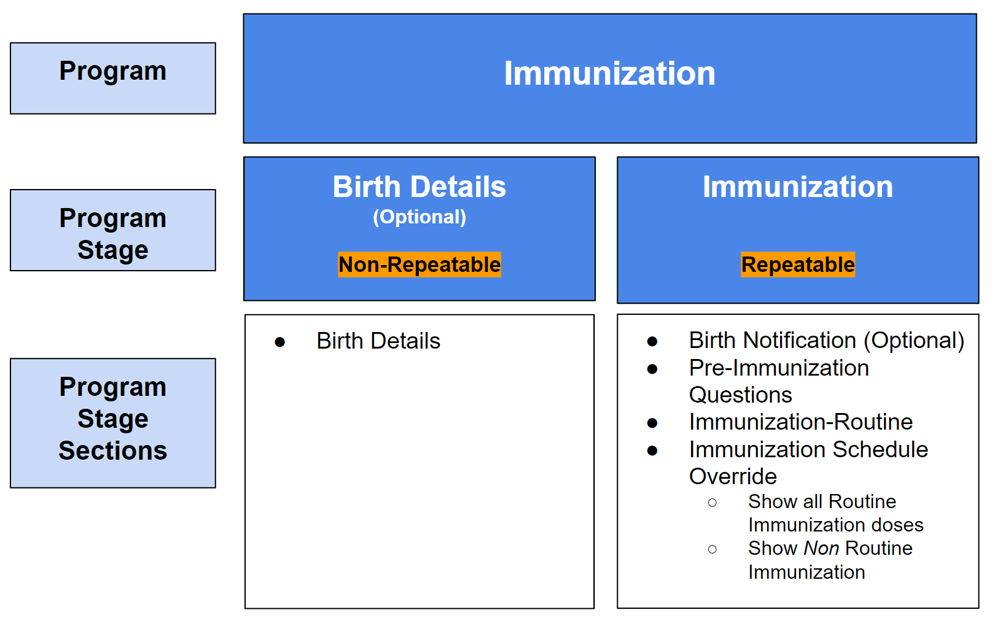

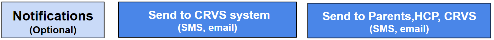

#### Routine Immunization Schedule

The Immunization eRegistry tracker program is configured by default to use the following vaccination schedule, detailed in the [WHO Position Papers-Recommendations for Routine Immunization](https://www.who.int/immunization/policy/Immunization_routine_table2.pdf?ua=1) (2018). Additional vaccines and modified immunization schedules can be added or altered depending on national guidelines. The default schedule that is configured within this program is as follows:

| Child’s Age | Vaccinations Required |
|-|-|
| Birth | BCG 0.05mg, bOPV0, Hep B1 |
| 6 weeks | bOPV1, Penta1, PCV1, RV1 |
| 10 weeks | bOPV2, Penta2, PCV2, RV2 |
| 14 weeks | bOPV3, IPV1, Penta3, PCV3 |
| 9 months | Measles 1, Rubella 1 |
| 18 months | Measles 2 |

#### Non Routine Immunizations

The Immunization eRegistry tracker program also includes a list of non-routine immunizations from the WHO guidance, allowing users of the immunization program to document any immunizations provided outside of the routine immunization schedule. National guidelines should be considered in the localization and adoption of the non-routine immunizations.

The non-routine immunizations included in this program are as follows:

* MR [2 doses]
* MMR [2 doses]
* Japanese Encephalitis (Inactivated vero cell-derived) [2 doses]
* Japanese Encephalitis (Live Attenuated) [2 doses]
* Yellow Fever [1 dose]
* Tick-Borne Encephalitis [3 doses]
* Typhoid TCV (Typbar) [1 dose]
* Typhoid (Vi PS ) [1 dose]
* Typhoid (Ty21a) [4 doses]
* Cholera [3 doses]
* Meningococcal [2 doses]
* Hepatitis A [1 dose]
* Rabies [2 doses]
* Dengue [3 doses]
* Varicella [2 doses]
* mOPV
* DPT (Booster) 1
* DTwP (Td containing) 1
* DTap (Td containing) 1
* Tdap (Td and ap containing) 1
* Hepatitis B2
* Hepatitis B3

### Rationale for Program Structure

**Birth details [non-repeatable]**: This stage is for capturing birth details such as mode of delivery, birth weight, etc, which need only be entered once. For this reason, the birth details stage is not repeatable. It was decided not to add birth details data points as attributes because these are not relevant case identifiers and are not required for longitudinal analysis.

**Immunization [repeatable]**: A single repeatable stage is used for capturing all immunization data (as opposed to multiple program stages per vaccine dose/schedule) because:

* It enables program rules to define what vaccine is due for a child based on the age and previous vaccine history;
* It is better for data quality as the only vaccines available for data entry are the vaccines which are due and the overall vaccine cycle is built in through program rules;
* It is easier for the user to conduct data entry, particularly when all vaccines for a particular age are not given together; and,
* It is easier to manage scheduling reminders based on program rules.

## Tracker Program Configuration

| Structure | Description |
|-|-|
| Enrollment | A child is registered and enrolled into the immunization program as a Tracked Entity Instance (TEI) and data about the child are captured in the Enrollment as attributes. The enrollment date is configured to display ‘registration date’ to the user.   TEI Attributes:     Unique identifier   National ID   First name   Middle name   Last name   Date of Birth*   Address   Gender   Village name   Mother/Caregiver’s first name*   Mother/Caregiver’s last name*   Mother/Caregiver’s ID   Mother/Caregiver’s contact number   Father/Caregiver’s first name   Father/Caregiver’s last name   Father/Caregiver’s ID   Father/Caregiver’s contact number   Photo   The program uses the date of birth extensively in program rules (e.g. to determine which vaccine should be displayed) and is configured as mandatory.   *Mandatory attributes |
| Program Stage 1: Birth Details   (non-repeatable) | This is a non-repeatable stage that captures information regarding the child’s birth/delivery.     Birth weight   Gestational age   Parity   Birth type   Attendant at birth   Place of birth   Place of birth_facility   Village name   Mode of delivery |
| Program Stage 2: Immunization   (Repeatable) | This is a repeatable stage. Data is entered for this stage each time a child receives a vaccination service. The program stage is configured to display the appropriate vaccinations using program rules based on the date of birth and the previous vaccination history.   Event date = date of services given |
| Section 2.1: Birth Notification (Optional) | Information about whether the child has been registered in the national CRVS system. This section may not be required for all country implementations. |
| Section 2.2: Pre-immunization questions | Includes information on where the child received these vaccinations, as well as identifying if there are any potential allergies and contraindications at the time of providing the vaccinations. |
| Section 2.3: Immunization - Routine | Includes details related to the provision of vaccines for children up to 18 months of age (ie. ending with Measles/Rubella 2nd dose), following the WHO recommended routine immunization schedule listed above. If vaccines are not provided, the reasoning behind this should be recorded in this stage. |
| Section 2.4: Immunization Schedule Override | This section includes two data elements that trigger program rules to override the program rules that generate the vaccine schedule for each vaccination event based on the TEI’s date of birth. By ‘overriding’ the program rules based on date of birth and immunization history, the user will have access to a full list of routine and non-routine immunizations for data entry. |
| Section 2.5: Non-routine immunization | This section captures vaccinations that are not part of the routine immunization schedule (e.g. yellow fever, Japanese encephalitis, etc). This section shows only when the user checks the ‘Show non routine vaccines’ checkbox in the Vaccine Schedule Override section. |

### Program Details

The **Tracked Entity Type** for this program is a ‘person’. Tracked entity types are often shared across programs in an integrated DHIS2 instance. Attributes include relevant case identifiers and registration details such as child’s name, date of birth, location, mother and father’s name and contact information. Other attributes have been selected based on a review of the resources listed in the references.

The program is configured to **require the user to search a minimum 2 attributes** before registering a new child. This configuration can be adapted according to country requirements.

#### Access

The **access** level is configured as **protected in** order to protect personally identifiable data from unauthorized access.

The user may search and read tracked entity instances that are owned by the organisation unit to which the user is assigned data capture access. If a user searches for a TEI that exists outside of their organisation unit,the user is presented with the option to access the patient record by first recording a reason. This approach to privacy is known as ‘breaking the glass’, since it allows the user to perform their work without outside permission or assistance, but leaves a clear trail to be audited. Once the user gives a reason for breaking the glass, then gain temporary ownership of the tracked entity instance (see the [Tracker User Guide](https://docs.dhis2.org/2.34/en/dhis2_user_manual_en/using-the-tracker-capture-app.html#breaking-the-glass) for more information.)

_Note that the ‘breaking the glass’ feature is not yet supported in DHIS2 Android Capture App as of v. 2.2.0; for countries that wish to implement the immunization tracker with Android app, it may be necessary to change the configuration of the Access level if users must be able to access and read TEIs enrolled outside of their data capture organisation unit._

**Example:** A child is registered at Facility A and gets BCG first dose at facility A then goes to Facility B for the PCV dose 1. If the access level in the program is protected, the user will be able to access the child’s record after entering a reason to break the glass.

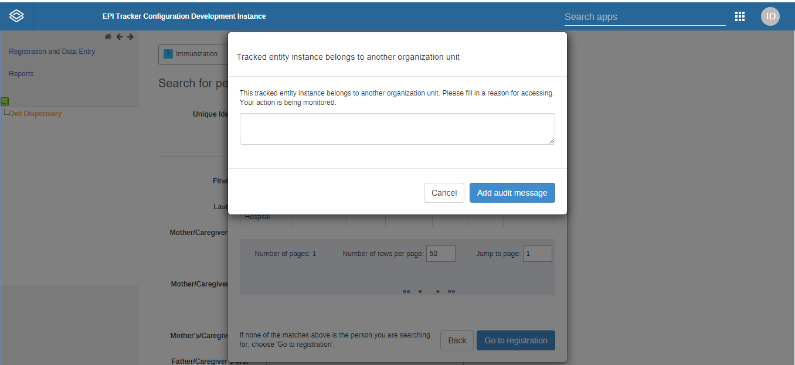

### Enrollment Details

The enrollment date description is ‘Registration date’. It is intended that the user enters the enrollment date as the date the child is being enrolled into the Immunization eRegistry program.

### Attributes

As the immunization program uses the date of birth extensively to determine which vaccine should be displayed, it is mandatory. There are limited fields that are mandatory to reduce the risk of false data being entered if a user is unable to enter all data fields. While the information on enrollment is meant to be completed when a case is first enrolled, attribute values can be updated at any point during an active enrollment if new information becomes available (eg contact information).

### Identifiers

The program is configured with two types of unique identifiers. Additional identifiers can be added to the program based on country context.

* [Unique Identifier]: An automatically generated ID which is unique to the entire system (e.g. the instance of DHIS2 being used). This TEI attribute is configured to generate the attribute value based on a pattern: CURRENT_DATE(yyyy-MM-dd)-"-"-SEQUENTIAL(#####).
* Note that this can only be used as a way to locate the patient in the system if the mother/child is given a card with the number that helps the user to identify them on subsequent visits.
* [National ID]: This ID is manually entered. In many countries, the National ID is the identification number given to the child by the National Civil Registry and Vital Events (CRVS) system once the child’s birth has been registered.

_*Android considerations: [Reserved IDs](https://docs.dhis2.org/2.34/en/implementer/html/dhis2_android_implementation_guideline_full.html#configuration_reserved_id) and [Expiry of Reserved IDs](https://community.dhis2.org/t/question-regarding-expiry-of-reserved-ids-of-an-auto-generated-unique-values-configured-with-a-text-pattern-containing-current-date-mm-yyyy/40761/2)_

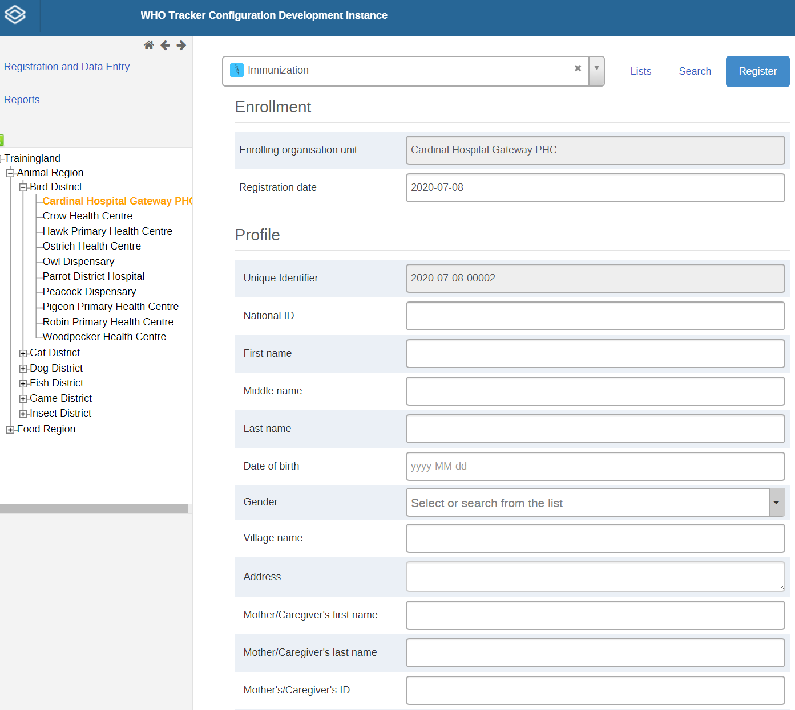

### Program Stage 1: Birth Details [non-repeatable]

Information collected in this stage is entered one time. This stage is optional and may not be required for all country contexts. In some contexts, this information may be recorded in other programs (e.g. such as a child program, delivery program, nutrition program, etc.). This information is important for a child’s longitudinal health data.

The data element ‘Facility/hospital of birth’ is configured as Type ‘Org Unit Hierarchy’, enabling the user to select a health facility within the org unit hierarchy. [^1]

### Program Stage 2: Immunization [repeatable]

#### Scheduling events

The stage is configured to ‘Ask user to create a new event when stage complete’, which triggers a pop-up for scheduling the follow up appointment. ‘Standard interval days’ are currently set to 30, so that the next appointment (event) date is scheduled 30 days from the current event date by default. The user may change the scheduled event date as required.

#### Section 2.1 Birth notification

The birth notification section enables notifications to the national Civil Registry and Vital Statistics (CRVS) system . This section is optional and may not be required depending on the decisions and workflows in-country. See documentation for the [Birth Notification Tracker Program](https://drive.google.com/file/d/1MQwYspJQe3jY3ja-DaVL7GUc7nwRGW5q/view?usp=sharing) for detailed information.

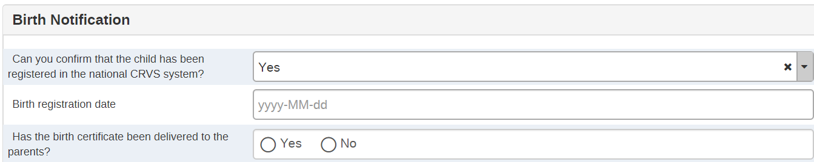

#### Section 2.2 Pre Immunization Questions

Includes information on where the child received these vaccinations as well as identifying if there are any potential allergies and contraindications at the time of providing the vaccinations. These questions were designed based on the [WHO Position Papers-Recommendations for Routine Immunization](https://www.who.int/immunization/policy/Immunization_routine_table2.pdf?ua=1) (2018).

The pre-Immunization questions are intended to be completed during each ‘event’, which represents an immunization service. Based on the answers selected, program rules are triggered to give decision support, facility monitoring, and follow up. These are shown in the TEI dashboard (e.g. allergies, high risk status) and are also used to trigger warnings and contraindications during immunization service delivery as in the screenshot below:

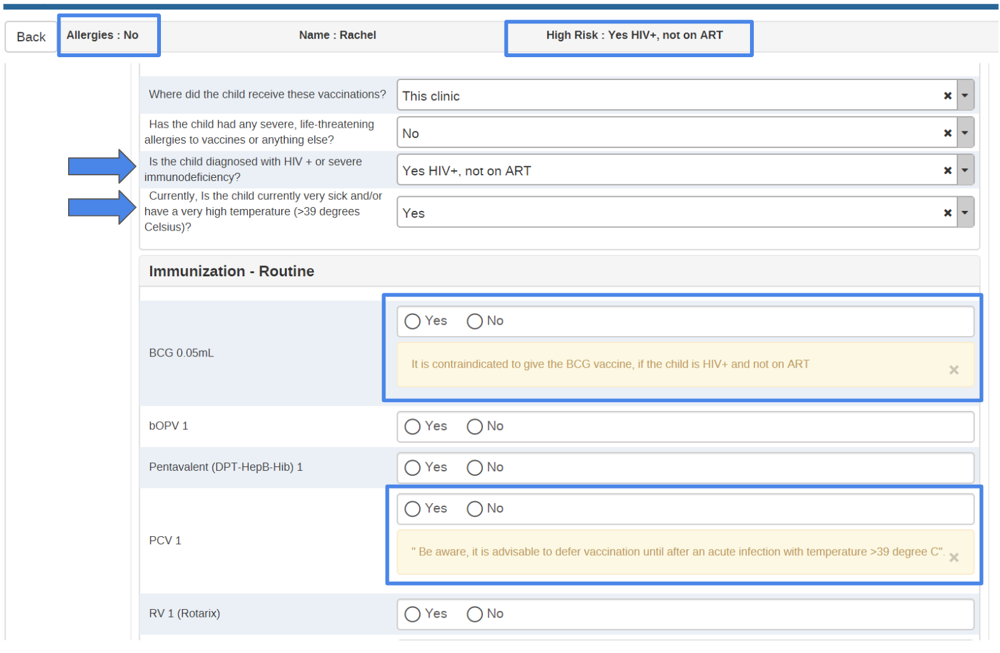

#### Section 2.3 Immunization - Routine

This section captures the immunization services delivered. Program rules are used to show the vaccinations that the child is scheduled to receive according to the WHO vaccination schedule. The program rules are based on the child’s date of birth and the previous vaccination history, conditions, and allergies. If the vaccine is not given, data elements are included for the user to record why it was not given, and the vaccine not given will show up in subsequent events/visits until the service has been recorded.

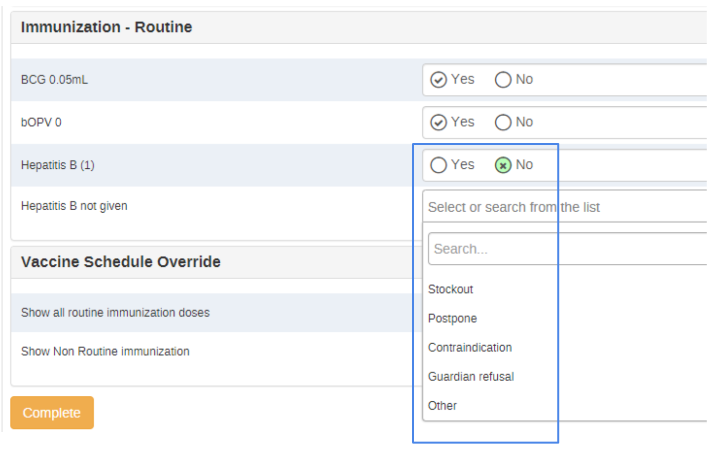

#### Section 2.4: Immunization Schedule Override

This section contains data elements that trigger program rules to show all available vaccines and doses to the user, instead of showing only the vaccines and doses that should be given based on the child’s age and immunization history.

##### [DE] Show all routine immunization doses

If this DE is checked and the user enters free text (at least 4 characters) for the data element _‘Show All immunization doses (explanation)’_, a program rule will show the entire routine immunization schedule list in the ‘Routine Immunization’ section for the user to complete data entry. The first time the entire immunization schedule is unlocked, the event date is recorded as a data element, and written to all subsequent events for the patient until opened again. In subsequent visits, the date of the schedule unlock is also shown in the top bar. This acts as a warning to future users that doses were provided out of schedule in a previous visit.

##### [DE] Show Non-routine Immunization

If this DE is checked an provides an explanation (at least 4 characters) in the data element ‘[Please explain why you need to show all possible non routine doses’ as free text, then all non-routine vaccines are shown for the user to complete data entry](https://who-dev.dhis2.org/tracker_dev/dhis-web-tracker-capture/index.html) in the section ‘Non-routine Immunizations’. The first time non-routine immunization is unlocked, the event date is recorded as a data element, and written to all subsequent events for the patient. This acts as a warning to future users that non-routine doses were provided during the prior visit.

Routine immunizations charted in the override section will be seen in the tabular data entry “vaccine card”. In subsequent visits, the vaccine charted by override will not be available in the schedule. The program rules are set to show the next dose in the series based on the pre configured time interval, and delivery of the prior dose in previous visits [

[see Program rules](#epi-tracker-program-rules)

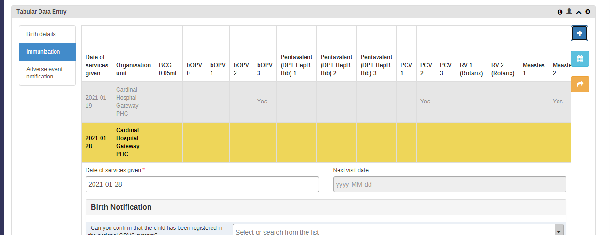

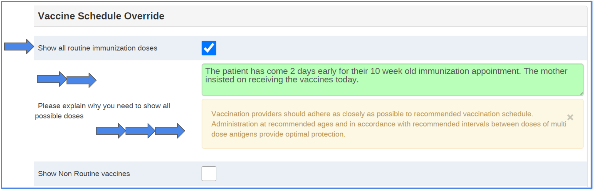

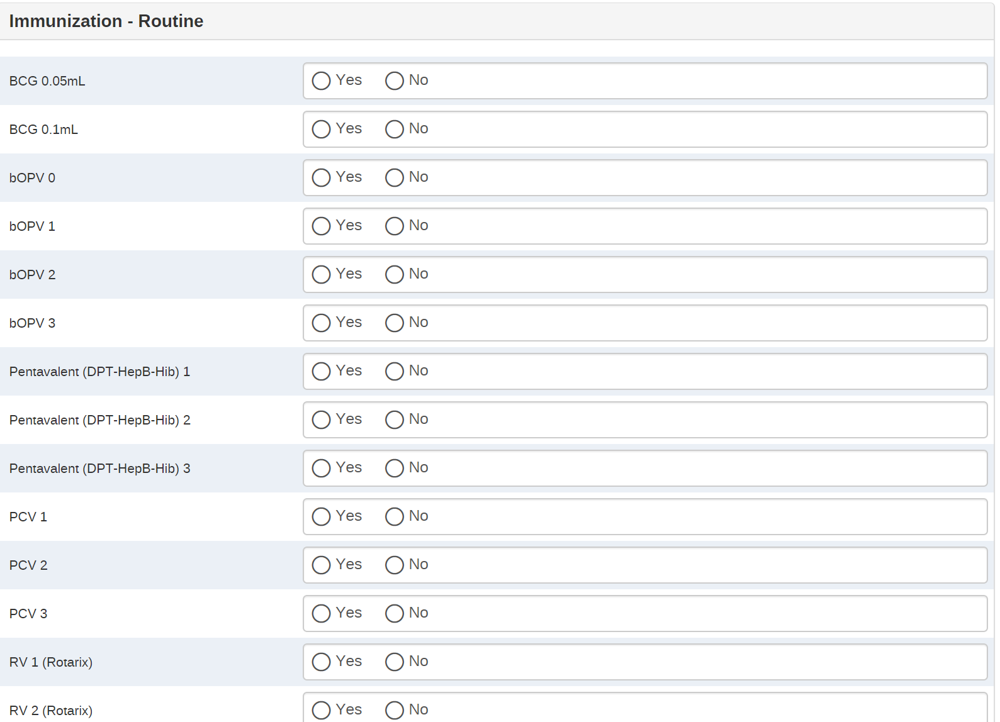

#### Section 2.5: Immunization - Non-Routine

This section contains data elements for entering non-routine immunizations such as Yellow fever, Tick borne Encephalitis, etc. By default, the entire section is hidden by program rules and is displayed only when the user checks the ‘Show non routine vaccines’ checkbox in the Vaccine Schedule Override section, and fills in the explanation data element.

By default, all non-routine immunizations will not be shown on the vaccine card. During implementation, EPI program managers should review the“non-routine” doses that are most commonly provided, and consider including these in the vaccine card.

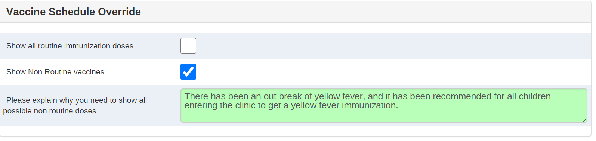

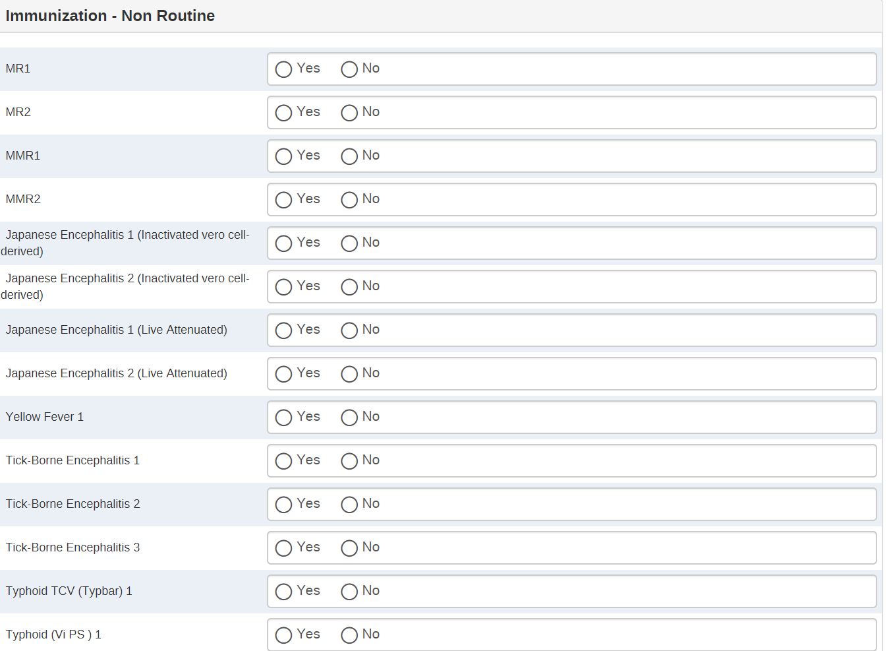

### Program Stage Notifications

Program stage notifications have been configured based on program rules to enable birth notification for CRVS and appointment reminders to parents/caregivers as described in the use case. These notifications can be sent by system messages (internal to DHIS2), external email, or by SMS.

#### SMS Reminders: Next Appointment

In the example shown below, a reminder message with the text in the screenshot will be sent to the child’s caregiver two days before the scheduled appointment. The text and dates for these reminders can be configured based on country requirements.

After the scheduled appointment is created, a new scheduled message is generated with attributes from the immunization record. This message is sent through the SMS gateway to the mother/caregiver’s phone number two days before the appointment.

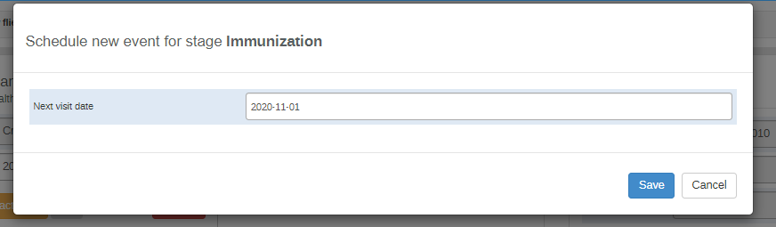

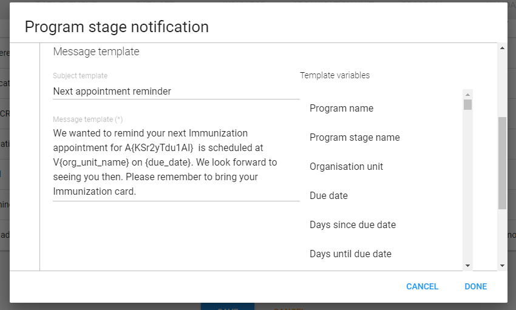

#### System Messages: CRVS Workflow

Program rules can also trigger messages through the DHIS2 messaging system. This can be particularly useful to integrate immunization registry data into the daily work of CRVS administrators.

The example below illustrates an example of responding “Yes” to birth notification delivering an immediate message to CRVS managers through the DHIS2 messaging system. Within the standard metadata package, messages may also be sent after reported birth certificate delivery, or non-delivery.

Example: CRVS Birth Notification -> Birth Certificate

1. New birth notification entered in the Immunization stage.
 CRVS notification has been completed, but a certificate has not been received.
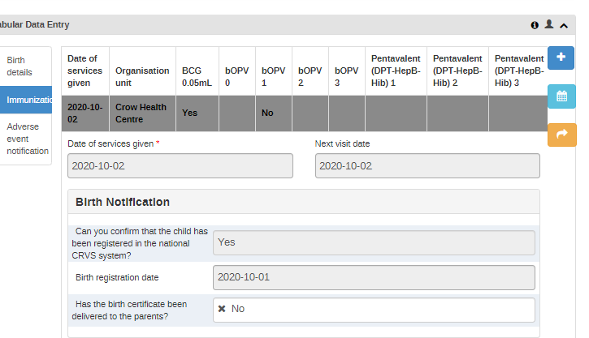

2. A message is immediately generated within DHIS2 for this new notification, and delivered to CRVS administrators user group.
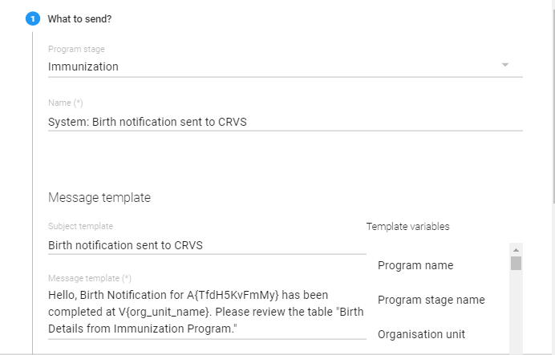

3. The message is delivered to the DHIS2 inbox (emails to the user can also be sent if configured).
 The message provides the location of report and child’s name.
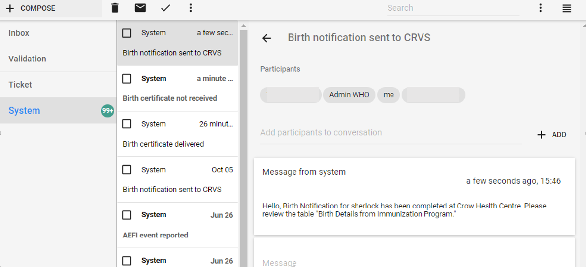

4. Birth details can be viewed by CRVS user in the Immunization Registry “program summary” report, and followed up for birth certificate delivery.
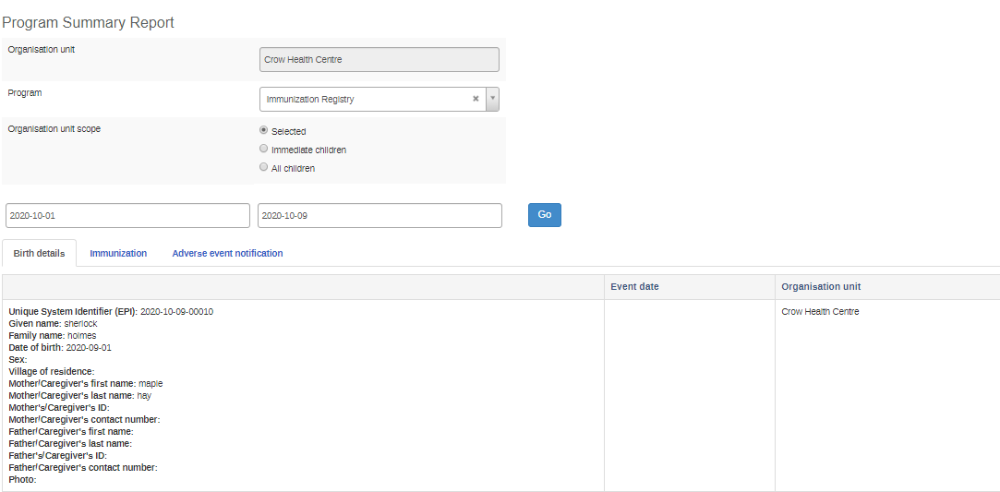

More information on how to configure program notifications can be found at [docs.dhis2.org](https://docs.dhis2.org/2.33/en/dhis2_user_manual_en/configure-programs-in-the-maintenance-app.html#create-program-notifications_1). To enable SMS notifications, an SMS gateway is required and the connection configured to DHIS2. More information on DHIS2 and SMS gateways can be found [here](https://docs.dhis2.org/master/en/developer/html/webapi_sms.html ).

### Program Rules { #epi-tracker-program-rules }

Program rules are used extensively to show data elements for routine vaccinations on the Routine Immunization event based on the date of birth (attribute) and previous vaccination history (data elements). **For this reason, entering the child’s date of birth in the enrollment is mandatory**.[^2] For example, when the date of birth matches the date on which services were provided (e.g. the child is a newborn), only the first two vaccinations (BCG and bOPV 0) appear on the routine immunization form, in alignment with the standard WHO vaccination schedule. 

_Routine immunization form for a child at birth (calculated by time between current event date and the TEI attribute Date of Birth):_

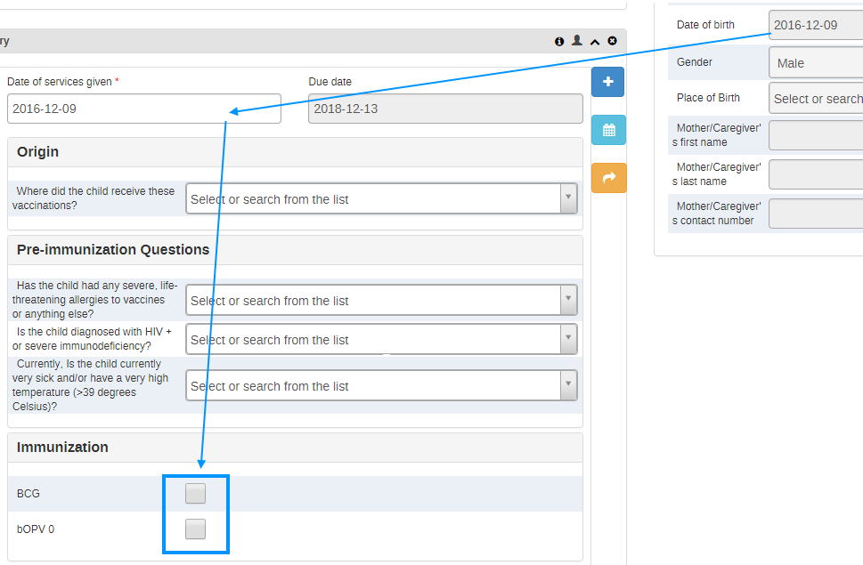

_Routine immunization form for a child 6 weeks old (calculated by time between current event date and the TEI attribute Date of Birth):_

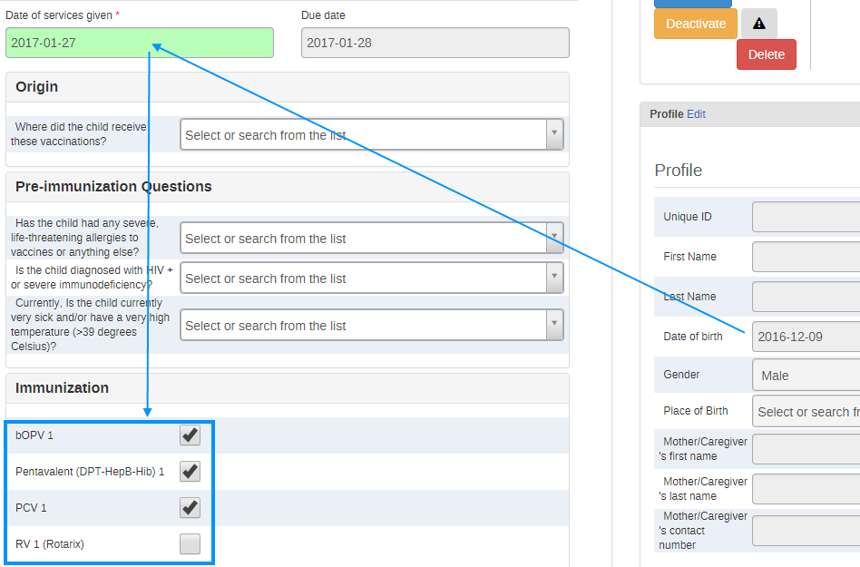

When vaccinations that are part of the routine schedule are missed, the next vaccine in the series does not appear. For example, if RV1 dose is not recorded, this vaccination will continue to appear on the Routine Immunization form -- regardless of the age of the child -- in subsequent events until it is recorded as administered. 

### Additional Features Configured to Support the Program

#### Tabular Data Entry: “Immunization card”

Tabular data entry view displays an electronic immunization card for the health care provider or data entry clerk that follows the format of the typical yellow paper-based immunization card that parents are generally required to bring to a child’s vaccination visit. The card gives the history of all the child’s immunizations. A standard legend is accessible by using the i button showing: Event is completed (Gray), Event is open (yellow), Event is scheduled (green), Event is overdue (Red).

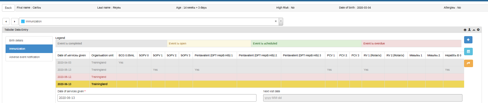

Vaccine status displayed as a table on tabular data entry (vaccine card) **displays only the routine vaccines as of now**. More vaccines can be added to the list or removed based on the user requirements. This can be done by selecting the view in reports options in the program stage configuration page.

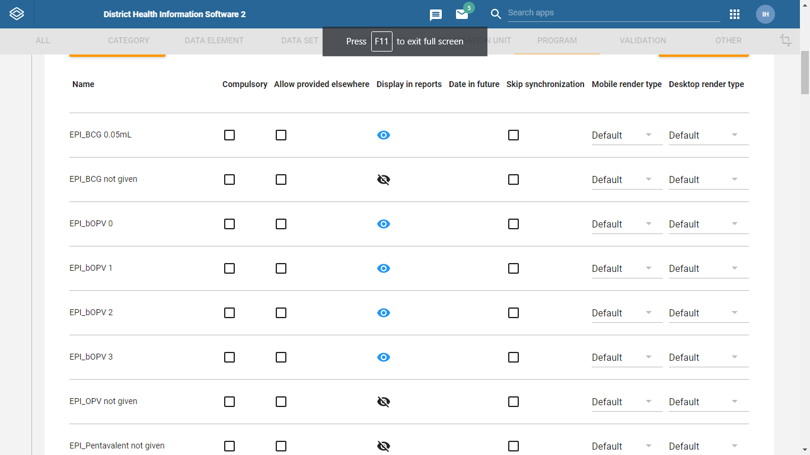

If vaccine override is done for non-routine vaccines, ‘Yes’ is not shown on the vaccine card. If vaccine override is done for routine vaccines then “Yes” is shown on the vaccine card for that event and dose. The “Yes” is carried forward to subsequent events, showing the dose has been already administered. However, it does not interrupt the schedule for subsequent doses in the schedule. For example, at an 8 weeks visit, bOPV 1 is administered as usual, and bOPV 2 is provided through an “override” of the schedule. Both of those doses will show as “Yes” on the vaccine card at the 8 week visit. bOPV 2 will not be shown again at a future 10 weeks visit (the normal scheduled time for the dose). Meanwhile, bOPV 3 will still be available at a 14 weeks visit.

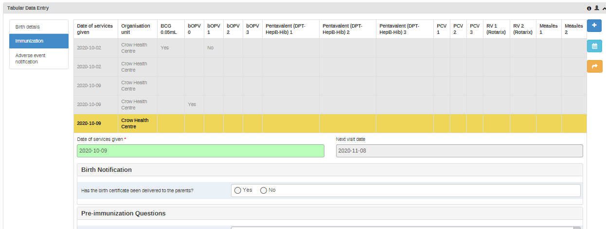

#### Top Bar Settings

Top-bar settings give health care providers/data entry clerks a quick at-a-glance view of the most important information about the child, including attributes (first name, last name, unique identifier), age at visit, feedback (risk status, allergies) and indicators (calculated age). The top bar settings can be defined/added/changed based on the country context, by clicking the settings icon at the far right of the bar. Clicking on the settings button takes you to the ‘Top bar settings’ view (see screenshot below) where the user can make changes to what patient information is displayed on the top bar.

_Top bar settings screenshot:_

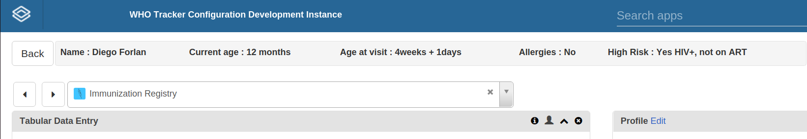

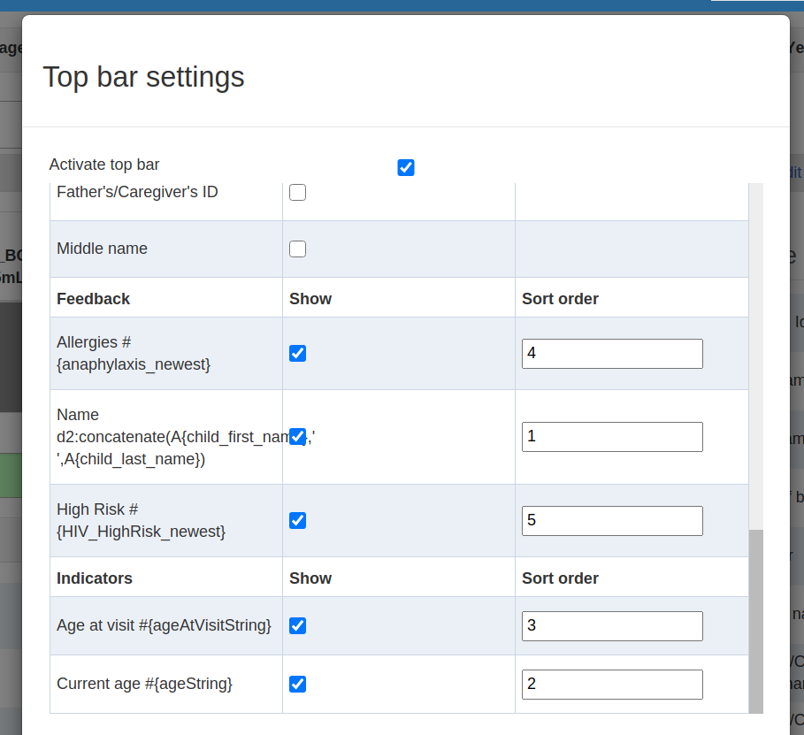

### Predefined Working Lists

To support quick search of patients at facility level, [four separate “working lists”](https://docs.dhis2.org/master/en/user/html/dhis2_user_manual_en_full.html#simple_tracked_entity_instance_search) are predefined in the “Lists” tab of the Tracker Capture landing page. Each of these working lists display TEI that meet certain criteria, such as upcoming appointments or missed appointments. They each display five key attributes: Unique System Identifier, Given Name, Family Name, Date of birth, Sex, and Mother’s Contact information.

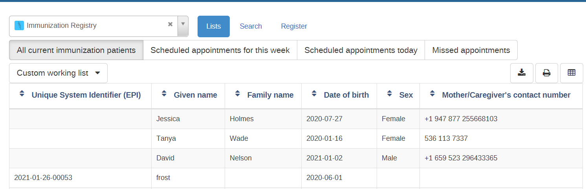

The following table describes the filter for each list, which can be altered through the API (See documentation for “[Tracked Entity Instance Filters](https://docs.dhis2.org/en/develop/using-the-api/dhis-core-version-master/tracker.html#webapi_tei_filters)”).

| Name | Description | Configuration |
|-|-|-|
| All current immunization patients | This provides a list of all patients registered in the Immunization program at the current organization unit | Enrollment status: ACTIVE |
| Scheduled appointments for this week | This provides a list of patients with scheduled appointment for this week (today and next 6 days) at the current organization unit | Enrollment status: ACTIVE   Event status (Immunization: 's53RFfXA75f'): SCHEDULE   Period (related to current date in days): 0-6 |
| Scheduled appointments for today | This provides a list of patients with a scheduled appointment today at the current organization unit | Enrollment status: ACTIVE   Event status (Immunization: 's53RFfXA75f'): SCHEDULE   Period (related to current date in days): 0-0 |
| Missed appointments | This provides a list of patients that have missed an appointment at the current organization unit | Enrollment status: ACTIVE   Event status (Immunization: 's53RFfXA75f'): OVERDUE   Period (related to current date in days): -1000;0 |

## Analytics & Indicators

The indicators are based on the [WHO EPI aggregate program](https://dhis2.org/who-package-downloads/#epi), with the intention that the relevant data collected in the Tracker program can be reported to the aggregate HMIS indicators. Note that the Immunization Tracker program can only calculate a subset of the [recommended aggregate indicators](https://who.dhis2.org/documentation/pck/EPI_DASHBOARD_V0_DHIS2.29/reference.html), including “doses given”, “dropout rate”. Indicators of immunization wastage rates and coverage rates would need to be sourced on data from logistics systems and population statistics, respectively.

In addition, many indicators from the Immunization Tracker program are based on cohorts, rather than raw counts. This is an important distinction that can lead to significant discrepancies between Tracker-based and Aggregate-based indicator values, in particular for calculating Dropout Rates, as illustrated below.

When estimating dropout rates with monthly aggregate data, many countries compare the total number of doses given for the first and last dose of a given vaccine regimen in a given time period.

Here the denominator is all first doses in a month. This assumes a stable enrollment rate. But compare the DPT1 doses administered in February and 12 months later. If the registration rate is increasing over time, there are always more patients receiving the first dose, than patients eligible for the final dose. This skews the dropout rate indicator.

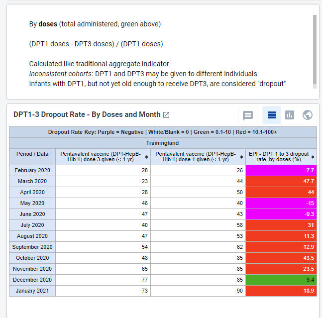

By comparison, the tracker data evaluates the age of all enrolled patients with DPT1, to calculate the cohort of infants who are due for a DPT3 dose each month.

If a cohort of infants pass 6 months of age and have DPT1, then they are considered due for DPT3. If they are due for DPT3 but do not have DPT3 at 6 months, they are considered dropouts. To avoid double counting, an infant can only be “due” for DPT3 in the time period when they pass 6 months of age.

While enrollment is increasing, most infants who have aged into eligibility for DPT3 have received the final dose.

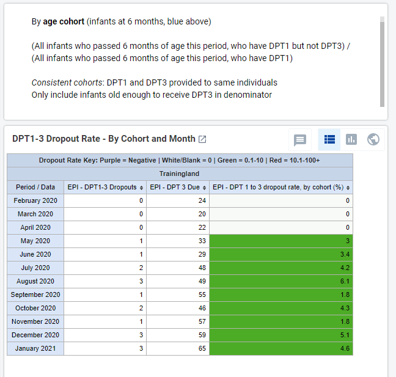

### Dashboards

Four dashboards are included in the metadata package, based on program indicators and indicators derived exclusively from Immunization program data. By default, dashboards are accessible to all users with access to the immunization program, including users in the “Immunization admin”,. “Immunization data capture” user groups.

Each of these dashboards is described in the table below.

* EPI Overall Rollout
* EPI Age Ranges
* EPI Dropout Rates
* EPI Vax Doses

#### EPI Overall Rollout

Total infants registered and doses administered during this year and previous calendar year; age at enrollment and visit; location of service delivery; and immunization blockages (e.g. contraindication and stockouts).

* How is the EPI program expanding over time? How many children has the program reached?
* When are infants starting immunization? Where do they receive vaccinations?
* Of those children that come to receive vaccination, what are the most common barriers to receiving their immunizations?

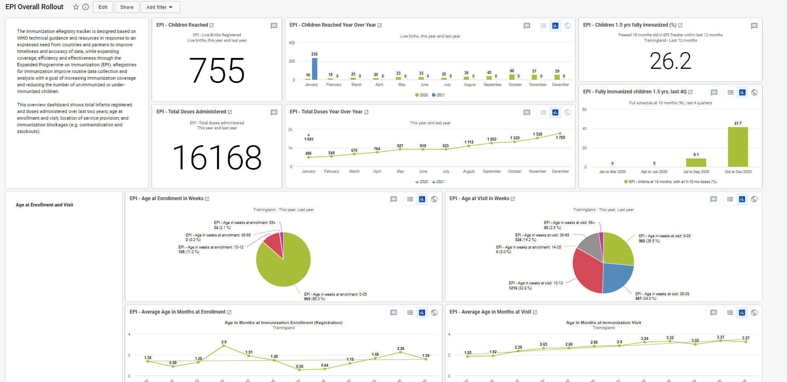

#### EPI Age Ranges

The proportion registered infants who just passed a key benchmarks for age (6 weeks, 14 weeks, 18 months, etc), and have received their full schedule of vaccines up to that point.

* What proportion of newborns receive bOPV, HepB1, and BCG0.05 before 6 weeks? Is there a regional difference? (Drill down by organization unit?)
* How many registered infants have turned 18 months old? How many have received all required immunizations by that age?
* Is there a major “drop off” between age ranges? Which dose could be causing a change in coverage between 10 and 14 weeks?

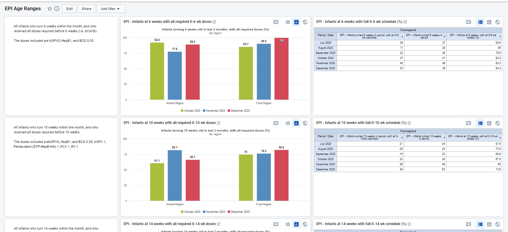

#### EPI Dropout Rates

Percent of the target population that has received the last recommended dose for each recommended vaccine. Includes monthly rates for DPT1-3, BCG-MCV, and MCV1-2, by number of doses delivered and eligible “cohorts”.

* Are most infants receiving all required doses for each vaccine?
* What is the difference in dropout rates by a consistent age cohort and by their sentinel doses? What could describe the discrepancy?

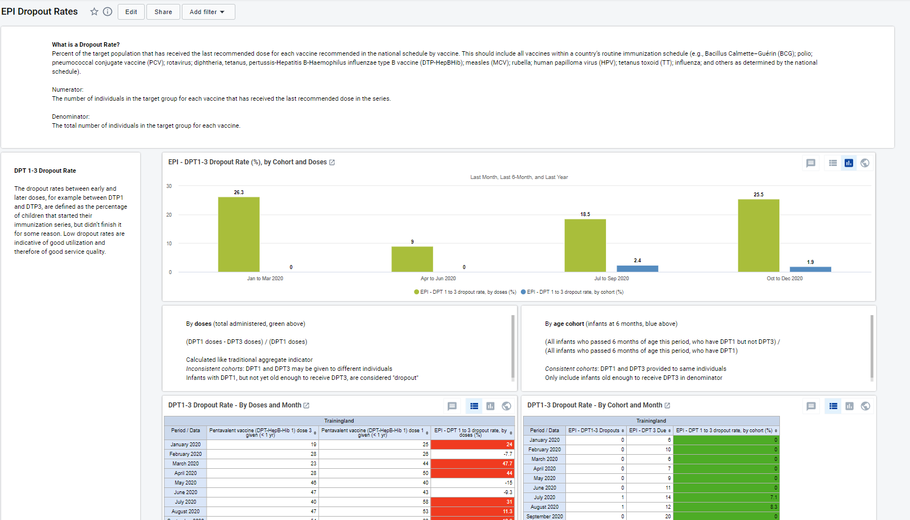

#### EPI Vax Doses

* The number of OPV/IPV, Penta, PCV, and RV doses delivered over the last 12 months and last 4 quarters.
* Which vaccines are used the most? Of those with multiple doses, which dose is lagging?
* How has the EPI program expanded over time, by vaccine?

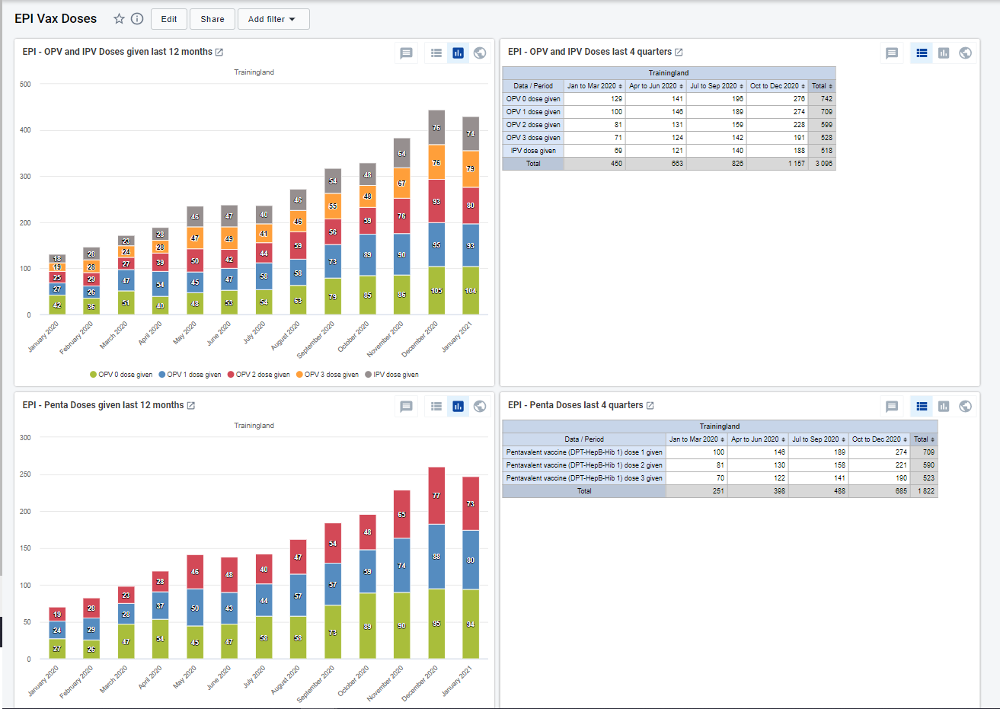

### Program Indicators

Details on Data Elements, Program Indicators, and Indicators can be found here:

Here is the link of showing program [data elements overview with descriptions and indicators](https://docs.google.com/spreadsheets/d/12XceAnwhofnShvE-_HTCXDCVX3VqoVMdSd8Gy2uZRUc/edit?usp=sharing)

## Android Compatibility

Digital data packages are optimized for Android data collection with the DHIS2 Capture App, free to download on the [Google Play store](https://play.google.com/store/apps/details?id=com.dhis2&hl=en). The following are known limitations of DHIS2 Android Capture app v 2.2.0 with implications on this tracker package:

**Access level ‘protected’:** The ‘breaking the glass’ feature is not yet supported in DHIS2 Android Capture App as of v. 2.2.0. If the program is configured as ‘Protected’, the default behavior for Android will be the same as if the program is configured as ‘closed.’ This means that an Android user will not be able to read or edit enrollments of a TEI outside of their org unit. TEIs registered in a Search OU will be returned by the TE Type search but if the program is closed or protected the user will not be allowed to see or create a new enrollment. If Android users must be able to access TEI outside of their data capture org unit, the program should be configured with access level ‘Open.’

## References

Pan American Health Organization. Electronic Immunization Registry: Practical Considerations for Planning, Development, Implementation and Evaluation. Washington, D.C.: PAHO; 2017. [https://iris.paho.org/handle/10665.2/34865](https://iris.paho.org/handle/10665.2/34865)

WHO (2018). Analysis and use of health facility data: Guidance for immunization programme managers. Retrieved from:

[https://www.who.int/healthinfo/FacilityAnalysisGuide_Immunization.pdf?ua=1](https://www.who.int/healthinfo/FacilityAnalysisGuide_Immunization.pdf?ua=1)

[WHO Position Papers-Recommendations for Routine Immunization](https://www.who.int/immunization/policy/Immunization_routine_table2.pdf?ua=1) (2018). Retrieved from: [https://www.who.int/immunization/policy/immunization_tables/en/](https://www.who.int/immunization/policy/immunization_tables/en/)

DHIS2 digital data package for aggregate EPI Aggregate. Retrieved from: [https://dhis2.org/who-package-downloads/#epi](https://dhis2.org/who-package-downloads/#epi)

[^1]:
 The available facilities to select for this data element depend on the “search org unit” configured for the end user. If a clinician only has access to search for and view records within her province, then she will not be able to select a facility outside her province as the “facility of birth”. System admins generally do not have this restriction and can enter all facilities within the system.

[^2]:
 Date of birth is mandatory by default for end users to ensure the child’s vaccination schedule is properly presented. However, date of birth is non-mandatory for system administrators to create test data without, for example to troubleshoot program rules..
