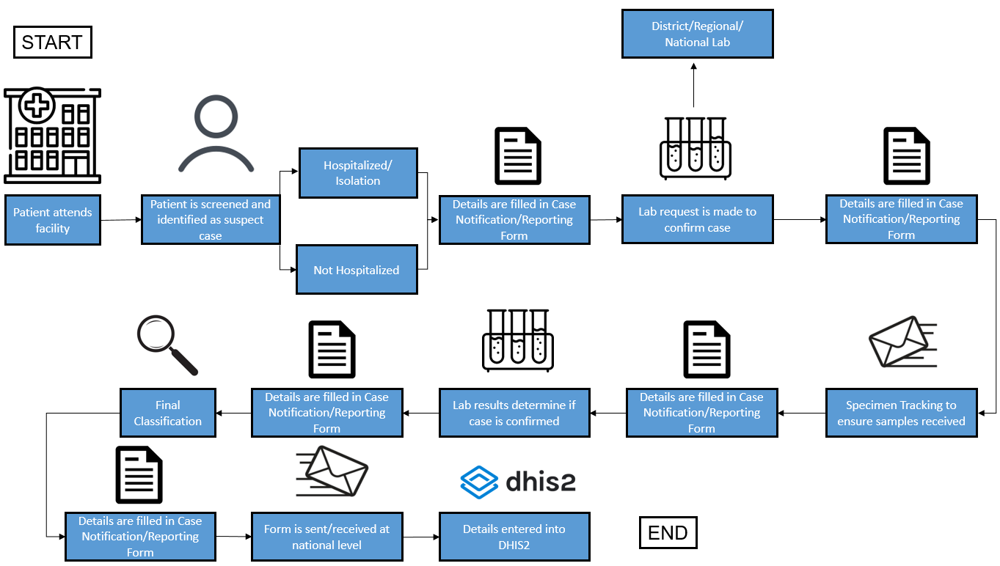
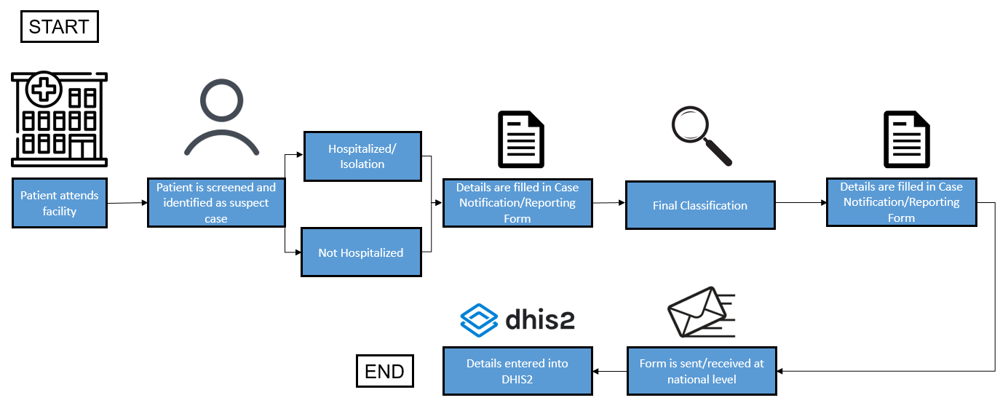

# **Vaccine Preventable Disease (VPD) Case-based Surveillance (CBS) Tracker System Design v1.0**

**_Table of Contents_**

* [Introduction](#introduction)
  * [Diseases Covered](#diseases-covered)
  * [Phases of Development](#phases-of-development)
    * [Phase 1](#phase-1)
    * [Phase 2](#phase-2)
  * [Program Description](#program-description)
  * [System Design Summary](#system-design-summary)
    * [CRS](#crs)
    * [IBVPD](#ibvpd)
    * [Measles/Rubella](#measles-rubella)
    * [Meningitis](#meningitis)
    * [Neonatal Tetanus](#neonatal-tetanus)
  * [AFP/Polio](#afp-polio)
  * [Rotavirus](#rotavirus)
  * [Yellow Fever](#yellow-fever)
  * [Program Workflow](#program-workflow)
  * [User Groups](#user-groups)
  * [Dashboards](#dashboards)
  * [Program Rules](#program-rules)
  * [Program Indicators](#program-indicators)
  * [Validation Rules and Notifications](#validation-rules-and-notifications)

## Introduction

The Vaccine Preventable Disease (VPD) Case Based Surveillance (CBS) system design document provides an overview of the conceptual design used to configure the VPD-CBS digital data package in DHIS2. The VPD-CBS digital data package is being rolled out in a series of phases. This design document covers phase 1 of this process. In phase 1, the VPD-CBS digital data package is meant first and foremost as an Epi-Info replacement, mainly within AFRO countries. It is recognized in this phase that local operational workflows, such as case notification forms, will not be part of this release. Despite this, moving the current EPI-Info VPD-CBS databases to DHIS2 will have several advantages. This includes:

1. All reported diseases being included in one place, rather than managing and merging different databases for entry, analysis and administration
2. Allowing staff to remotely access details related to a case they are working on (ie. lab staff, clinical staff)
3. Allowing results to be synchronized to a regional platform through sending data, rather than through manual processes

This document is intended for use by DHIS2 implementers at country and regional level to be able to support implementation and localisation of the package. The VPD-CBS metadata package can be adapted to local needs and national guidelines; however any key elements that are required by the regional platform will be mandatory and should therefore not be modified.

## Diseases Covered

This package is meant to serve integrated workflows of 9 different diseases within the same system and is meant as a more sustainable approach than having different systems or databases for each individual disease. The diseases covered in this package include:

1. Congenital Rubella Syndrome (CRS)
2. Invasive Bacterial Vaccine Preventable Disease (IBVPD)
3. Measles/Rubella
4. Meningitis
5. Neonatal Tetanus
6. Polio (Acute Flaccid Paralysis)
7. Rotavirus
8. Rotavirus Impact
9. Yellow Fever

## Phases of Development

This use case is divided into 2 development phases as it relates to case based surveillance, with this document covering phase 1 of the initial scope of requirements. In broad terms, the phases are divided into the following

#### Phase 1

* Use of DHIS2 to replace all current functionality and workflow of AFRO VPD surveillance EPI Info systems
* Phase out use of EPI Info in AFRO countries; implement DHIS2 as the EPI Info replacement

#### Phase 2

* Strengthen response and management of public health actions through the support of local workflows, access control and functionality for identification and management of outbreaks directly within DHIS2
* Expand availability, guidance and implementation support for non-AFRO countries

## Program Description

All of the programs in the VPD-CBS package have a similar design, however different sections and variables are attached to each disease **_ based on the initial diagnosis that is selected during registration_**. The sections attached to each program are described in the [System Design Summary](#ystem-design-summary) section of this document. For a full listing of the variables for each disease, please refer to the  [surveillance data elements](https://drive.google.com/file/d/1IL2fRyBcVI5IP-cTrwQW9dEqry7RI5dz/view?usp=sharing) document. The program is made up of the following stages in its design:

1. Enrollment Details
2. Diagnostic & Clinical Information
3. Laboratory request
4. Specimen Tracking
5. Laboratory Result
6. Final Classification

Note that Neonatal Tetanus has a slightly different configuration, as it only includes the following stages in its design:

1. Enrollment Details
2. Diagnostic & Clinical Information
3. Final Classification

| Stage                                          | Description                                                                                                                                                                                                                                                                                                                                                                                                                                                                                                                                                                                                                                                                                                                                                                                                                                                                                 |
|------------------------------------------------|---------------------------------------------------------------------------------------------------------------------------------------------------------------------------------------------------------------------------------------------------------------------------------------------------------------------------------------------------------------------------------------------------------------------------------------------------------------------------------------------------------------------------------------------------------------------------------------------------------------------------------------------------------------------------------------------------------------------------------------------------------------------------------------------------------------------------------------------------------------------------------------------|
| Enrollment details Attributes                  | The Tracked Entity is the case, which is represented by a Tracked Entity Type of ‘person.’ Cases are uniquely identified by the Disease specific Epid Number that is assigned to them. This number is a combination of their Epid Number and the disease identified during their initial diagnosis. Enrollment date = Date of notification Incident date = Date of symptoms onset Attributes include basic personal information and unique case identifiers. The attributes within this program include: System Generated Case ID Epid number First Name Last Name Date of birth Age (Years) Age (Months) Sex Home address Village/Neighbourhood Town/City District of residence Province of residence Telephone (local) Workplace/school physical address Facility contact number First name (parent or carer) Last name (parent or carer) Clinical diagnosis Disease specific Epid Number |
| Stage 1: \ \ Diagnostic & Clinical Information | This stage records a suspected case’s clinical details and admission information, signs and symptoms, vaccination history, notification information and outcome.                                                                                                                                                                                                                                                                                                                                                                                                                                                                                                                                                                                                                                                                                                                            |
| Stage 2: \ \ Lab Request [repeatable]          | The lab request records details related to any specimens that are being sent to the lab for processing. The information provided here can help lab personnel prioritize lab tests when resources are limited. The person entering this data could be the same person who registered the suspected case and recorded the patient’s clinical exam and exposures; or may be other personnel charged with making lab requests.                                                                                                                                                                                                                                                                                                                                                                                                                                                                  |
| Stage 3: Specimen Tracking [repeatable]        | Specimen tracking records when lab specimen’s sent for processing were received at various lab levels.                                                                                                                                                                                                                                                                                                                                                                                                                                                                                                                                                                                                                                                                                                                                                                                      |
| Stage 4: \ \ Laboratory Result [repeatable]    | The lab results stage records the specimen type and results from laboratory testing. It can be done directly at the lab or as secondary data entry. This stage is repeatable as samples for a given case may be tested multiple times (i.e. in the case of an inconclusive laboratory results, a new lab test can be conducted and results recorded) and/or multiple samples may also need to be processed.                                                                                                                                                                                                                                                                                                                                                                                                                                                                                 |
| Stage 5: Final Classification                  | The final classification records the final confirmed classification of the case as it relates to the initial diagnosis.                                                                                                                                                                                                                                                                                                                                                                                                                                                                                                                                                                                                                                                                                                                                                                     |

## System Design Summary

The DHIS2 VPD-CBS digital data package metadata is based on reporting templates available for each disease within the EPI-Info application. A full list of variables used for data collection that are included in the package can be viewed in the [surveillance data elements](https://drive.google.com/file/d/1IL2fRyBcVI5IP-cTrwQW9dEqry7RI5dz/view?usp=sharing) document. In addition to the data collection components associated with this package, a number of outputs have been created and are described in more detail in the _Dashboard Design Summary** **_section of this document.

In the development of this configuration package, an effort has been made to follow UiO’s [general design principles](https://who.dhis2.org/documentation/general_design_principles.html) and a common [naming convention](https://who.dhis2.org/documentation/naming_convention.html).

The VPD-CBS digital data package supports the collection of information based upon the initial clinical diagnosis that is selected. Each initial diagnosis has its own set of associated sections and variables that are displayed based upon the initial diagnosis that is selected. A listing of the program stages and program stage sections for each disease can be found in the subsequent tables within this section of the document. You can select a disease in order to be taken to it’s design details within the document.

1. [Congenital Rubella Syndrome (CRS)](#crs)
2. [Invasive Bacterial Vaccine Preventable Disease (IBVPD)](#ivpd)
3. [Measles/Rubella](#measles/rubella)
4. [Meningitis](#meningitis)
5. [Neonatal Tetanus](#tetanus)
6. [Polio (Acute Flaccid Paralysis)](#afp/polio)
7. [Rotavirus](#rotavirus)
8. [Rotavirus Impact](#rotavirus-impact)
9. [Yellow Fever](#yellow-fever)

### CRS

| Stage                                          | Description                                                                                                                                                                                                                                                                                                                                                                                                                                                                                                                                                                                                                                                                                                                                                                                                                                                                                 |
|------------------------------------------------|---------------------------------------------------------------------------------------------------------------------------------------------------------------------------------------------------------------------------------------------------------------------------------------------------------------------------------------------------------------------------------------------------------------------------------------------------------------------------------------------------------------------------------------------------------------------------------------------------------------------------------------------------------------------------------------------------------------------------------------------------------------------------------------------------------------------------------------------------------------------------------------------|
| Enrollment details Attributes                  | The Tracked Entity is the case, which is represented by a Tracked Entity Type of ‘person.’ Cases are uniquely identified by the Disease specific Epid Number that is assigned to them. This number is a combination of their Epid Number and the disease identified during their initial diagnosis. Enrollment date = Date of notification Incident date = Date of symptoms onset Attributes include basic personal information and unique case identifiers. The attributes within this program include: System Generated Case ID Epid number First Name Last Name Date of birth Age (Years) Age (Months) Sex Home address Village/Neighbourhood Town/City District of residence Province of residence Telephone (local) Workplace/school physical address Facility contact number First name (parent or carer) Last name (parent or carer) Clinical diagnosis Disease specific Epid Number |
| Stage 1: \ \ Diagnostic & Clinical Information | This stage records a suspected case’s clinical details and admission information, signs and symptoms, vaccination history, notification information and outcome.                                                                                                                                                                                                                                                                                                                                                                                                                                                                                                                                                                                                                                                                                                                            |
| Stage 2: \ \ Lab Request [repeatable]          | The lab request records details related to any specimens that are being sent to the lab for processing. The information provided here can help lab personnel prioritize lab tests when resources are limited. The person entering this data could be the same person who registered the suspected case and recorded the patient’s clinical exam and exposures; or may be other personnel charged with making lab requests.                                                                                                                                                                                                                                                                                                                                                                                                                                                                  |
| Stage 3: Specimen Tracking [repeatable]        | Specimen tracking records when lab specimen’s sent for processing were received at various lab levels.                                                                                                                                                                                                                                                                                                                                                                                                                                                                                                                                                                                                                                                                                                                                                                                      |
| Stage 4: \ \ Laboratory Result [repeatable]    | The lab results stage records the specimen type and results from laboratory testing. It can be done directly at the lab or as secondary data entry. This stage is repeatable as samples for a given case may be tested multiple times (i.e. in the case of an inconclusive laboratory results, a new lab test can be conducted and results recorded) and/or multiple samples may also need to be processed.                                                                                                                                                                                                                                                                                                                                                                                                                                                                                 |
| Stage 5: Final Classification                  | The final classification records the final confirmed classification of the case as it relates to the initial diagnosis.                                                                                                                                                                                                                                                                                                                                                                                                                                                                                                                                                                                                                                                                                                                                                                     |

### IBVPD

| Stage                                          | Description                                                                                                                                                                                                                                                                                                                                                                                                                                                                                                                                                                                                                                                                                                                                                                                                                                                                                 |
|------------------------------------------------|---------------------------------------------------------------------------------------------------------------------------------------------------------------------------------------------------------------------------------------------------------------------------------------------------------------------------------------------------------------------------------------------------------------------------------------------------------------------------------------------------------------------------------------------------------------------------------------------------------------------------------------------------------------------------------------------------------------------------------------------------------------------------------------------------------------------------------------------------------------------------------------------|
| Enrollment details Attributes                  | The Tracked Entity is the case, which is represented by a Tracked Entity Type of ‘person.’ Cases are uniquely identified by the Disease specific Epid Number that is assigned to them. This number is a combination of their Epid Number and the disease identified during their initial diagnosis. Enrollment date = Date of notification Incident date = Date of symptoms onset Attributes include basic personal information and unique case identifiers. The attributes within this program include: System Generated Case ID Epid number First Name Last Name Date of birth Age (Years) Age (Months) Sex Home address Village/Neighbourhood Town/City District of residence Province of residence Telephone (local) Workplace/school physical address Facility contact number First name (parent or carer) Last name (parent or carer) Clinical diagnosis Disease specific Epid Number |
| Stage 1: \ \ Diagnostic & Clinical Information | This stage records a suspected case’s clinical details and admission information, signs and symptoms, vaccination history, notification information and outcome.                                                                                                                                                                                                                                                                                                                                                                                                                                                                                                                                                                                                                                                                                                                            |
| Stage 2: \ \ Lab Request [repeatable]          | The lab request records details related to any specimens that are being sent to the lab for processing. The information provided here can help lab personnel prioritize lab tests when resources are limited. The person entering this data could be the same person who registered the suspected case and recorded the patient’s clinical exam and exposures; or may be other personnel charged with making lab requests.                                                                                                                                                                                                                                                                                                                                                                                                                                                                  |
| Stage 3: Specimen Tracking [repeatable]        | Specimen tracking records when lab specimen’s sent for processing were received at various lab levels.                                                                                                                                                                                                                                                                                                                                                                                                                                                                                                                                                                                                                                                                                                                                                                                      |
| Stage 4: \ \ Laboratory Result [repeatable]    | The lab results stage records the specimen type and results from laboratory testing. It can be done directly at the lab or as secondary data entry. This stage is repeatable as samples for a given case may be tested multiple times (i.e. in the case of an inconclusive laboratory results, a new lab test can be conducted and results recorded) and/or multiple samples may also need to be processed.                                                                                                                                                                                                                                                                                                                                                                                                                                                                                 |
| Stage 5: Final Classification                  | The final classification records the final confirmed classification of the case as it relates to the initial diagnosis.                                                                                                                                                                                                                                                                                                                                                                                                                                                                                                                                                                                                                                                                                                                                                                     |

### Measles/Rubella

| Stage                                          | Description                                                                                                                                                                                                                                                                                                                                                                                                                                                                                                                                                                                                                                                                                                                                                                                                                                                                                 |
|------------------------------------------------|---------------------------------------------------------------------------------------------------------------------------------------------------------------------------------------------------------------------------------------------------------------------------------------------------------------------------------------------------------------------------------------------------------------------------------------------------------------------------------------------------------------------------------------------------------------------------------------------------------------------------------------------------------------------------------------------------------------------------------------------------------------------------------------------------------------------------------------------------------------------------------------------|
| Enrollment details Attributes                  | The Tracked Entity is the case, which is represented by a Tracked Entity Type of ‘person.’ Cases are uniquely identified by the Disease specific Epid Number that is assigned to them. This number is a combination of their Epid Number and the disease identified during their initial diagnosis. Enrollment date = Date of notification Incident date = Date of symptoms onset Attributes include basic personal information and unique case identifiers. The attributes within this program include: System Generated Case ID Epid number First Name Last Name Date of birth Age (Years) Age (Months) Sex Home address Village/Neighbourhood Town/City District of residence Province of residence Telephone (local) Workplace/school physical address Facility contact number First name (parent or carer) Last name (parent or carer) Clinical diagnosis Disease specific Epid Number |
| Stage 1: \ \ Diagnostic & Clinical Information | This stage records a suspected case’s clinical details and admission information, signs and symptoms, vaccination history, notification information and outcome.                                                                                                                                                                                                                                                                                                                                                                                                                                                                                                                                                                                                                                                                                                                            |
| Stage 2: \ \ Lab Request [repeatable]          | The lab request records details related to any specimens that are being sent to the lab for processing. The information provided here can help lab personnel prioritize lab tests when resources are limited. The person entering this data could be the same person who registered the suspected case and recorded the patient’s clinical exam and exposures; or may be other personnel charged with making lab requests.                                                                                                                                                                                                                                                                                                                                                                                                                                                                  |
| Stage 3: Specimen Tracking [repeatable]        | Specimen tracking records when lab specimen’s sent for processing were received at various lab levels.                                                                                                                                                                                                                                                                                                                                                                                                                                                                                                                                                                                                                                                                                                                                                                                      |
| Stage 4: \ \ Laboratory Result [repeatable]    | The lab results stage records the specimen type and results from laboratory testing. It can be done directly at the lab or as secondary data entry. This stage is repeatable as samples for a given case may be tested multiple times (i.e. in the case of an inconclusive laboratory results, a new lab test can be conducted and results recorded) and/or multiple samples may also need to be processed.                                                                                                                                                                                                                                                                                                                                                                                                                                                                                 |
| Stage 5: Final Classification                  | The final classification records the final confirmed classification of the case as it relates to the initial diagnosis.                                                                                                                                                                                                                                                                                                                                                                                                                                                                                                                                                                                                                                                                                                                                                                     |

### Meningitis

| Stage                                          | Description                                                                                                                                                                                                                                                                                                                                                                                                                                                                                                                                                                                                                                                                                                                                                                                                                                                                                 |
|------------------------------------------------|---------------------------------------------------------------------------------------------------------------------------------------------------------------------------------------------------------------------------------------------------------------------------------------------------------------------------------------------------------------------------------------------------------------------------------------------------------------------------------------------------------------------------------------------------------------------------------------------------------------------------------------------------------------------------------------------------------------------------------------------------------------------------------------------------------------------------------------------------------------------------------------------|
| Enrollment details Attributes                  | The Tracked Entity is the case, which is represented by a Tracked Entity Type of ‘person.’ Cases are uniquely identified by the Disease specific Epid Number that is assigned to them. This number is a combination of their Epid Number and the disease identified during their initial diagnosis. Enrollment date = Date of notification Incident date = Date of symptoms onset Attributes include basic personal information and unique case identifiers. The attributes within this program include: System Generated Case ID Epid number First Name Last Name Date of birth Age (Years) Age (Months) Sex Home address Village/Neighbourhood Town/City District of residence Province of residence Telephone (local) Workplace/school physical address Facility contact number First name (parent or carer) Last name (parent or carer) Clinical diagnosis Disease specific Epid Number |
| Stage 1: \ \ Diagnostic & Clinical Information | This stage records a suspected case’s clinical details and admission information, signs and symptoms, vaccination history, notification information and outcome.                                                                                                                                                                                                                                                                                                                                                                                                                                                                                                                                                                                                                                                                                                                            |
| Stage 2: \ \ Lab Request [repeatable]          | The lab request records details related to any specimens that are being sent to the lab for processing. The information provided here can help lab personnel prioritize lab tests when resources are limited. The person entering this data could be the same person who registered the suspected case and recorded the patient’s clinical exam and exposures; or may be other personnel charged with making lab requests.                                                                                                                                                                                                                                                                                                                                                                                                                                                                  |
| Stage 3: Specimen Tracking [repeatable]        | Specimen tracking records when lab specimen’s sent for processing were received at various lab levels.                                                                                                                                                                                                                                                                                                                                                                                                                                                                                                                                                                                                                                                                                                                                                                                      |
| Stage 4: \ \ Laboratory Result [repeatable]    | The lab results stage records the specimen type and results from laboratory testing. It can be done directly at the lab or as secondary data entry. This stage is repeatable as samples for a given case may be tested multiple times (i.e. in the case of an inconclusive laboratory results, a new lab test can be conducted and results recorded) and/or multiple samples may also need to be processed.                                                                                                                                                                                                                                                                                                                                                                                                                                                                                 |
| Stage 5: Final Classification                  | The final classification records the final confirmed classification of the case as it relates to the initial diagnosis.                                                                                                                                                                                                                                                                                                                                                                                                                                                                                                                                                                                                                                                                                                                                                                     |

### Neonatal Tetanus

| Stage                                          | Description                                                                                                                                                                                                                                                                                                                                                                                                                                                                                                                                                                                                                                                                                                                                                                                                                                                                                 |
|------------------------------------------------|---------------------------------------------------------------------------------------------------------------------------------------------------------------------------------------------------------------------------------------------------------------------------------------------------------------------------------------------------------------------------------------------------------------------------------------------------------------------------------------------------------------------------------------------------------------------------------------------------------------------------------------------------------------------------------------------------------------------------------------------------------------------------------------------------------------------------------------------------------------------------------------------|
| Enrollment details Attributes                  | The Tracked Entity is the case, which is represented by a Tracked Entity Type of ‘person.’ Cases are uniquely identified by the Disease specific Epid Number that is assigned to them. This number is a combination of their Epid Number and the disease identified during their initial diagnosis. Enrollment date = Date of notification Incident date = Date of symptoms onset Attributes include basic personal information and unique case identifiers. The attributes within this program include: System Generated Case ID Epid number First Name Last Name Date of birth Age (Years) Age (Months) Sex Home address Village/Neighbourhood Town/City District of residence Province of residence Telephone (local) Workplace/school physical address Facility contact number First name (parent or carer) Last name (parent or carer) Clinical diagnosis Disease specific Epid Number |
| Stage 1: \ \ Diagnostic & Clinical Information | This stage records a suspected case’s clinical details and admission information, signs and symptoms, vaccination history, notification information and outcome.                                                                                                                                                                                                                                                                                                                                                                                                                                                                                                                                                                                                                                                                                                                            |
| Stage 2: \ \ Lab Request [repeatable]          | The lab request records details related to any specimens that are being sent to the lab for processing. The information provided here can help lab personnel prioritize lab tests when resources are limited. The person entering this data could be the same person who registered the suspected case and recorded the patient’s clinical exam and exposures; or may be other personnel charged with making lab requests.                                                                                                                                                                                                                                                                                                                                                                                                                                                                  |
| Stage 3: Specimen Tracking [repeatable]        | Specimen tracking records when lab specimen’s sent for processing were received at various lab levels.                                                                                                                                                                                                                                                                                                                                                                                                                                                                                                                                                                                                                                                                                                                                                                                      |
| Stage 4: \ \ Laboratory Result [repeatable]    | The lab results stage records the specimen type and results from laboratory testing. It can be done directly at the lab or as secondary data entry. This stage is repeatable as samples for a given case may be tested multiple times (i.e. in the case of an inconclusive laboratory results, a new lab test can be conducted and results recorded) and/or multiple samples may also need to be processed.                                                                                                                                                                                                                                                                                                                                                                                                                                                                                 |
| Stage 5: Final Classification                  | The final classification records the final confirmed classification of the case as it relates to the initial diagnosis.                                                                                                                                                                                                                                                                                                                                                                                                                                                                                                                                                                                                                                                                                                                                                                     |

## AFP/Polio

| Stage                                          | Description                                                                                                                                                                                                                                                                                                                                                                                                                                                                                                                                                                                                                                                                                                                                                                                                                                                                                 |
|------------------------------------------------|---------------------------------------------------------------------------------------------------------------------------------------------------------------------------------------------------------------------------------------------------------------------------------------------------------------------------------------------------------------------------------------------------------------------------------------------------------------------------------------------------------------------------------------------------------------------------------------------------------------------------------------------------------------------------------------------------------------------------------------------------------------------------------------------------------------------------------------------------------------------------------------------|
| Enrollment details Attributes                  | The Tracked Entity is the case, which is represented by a Tracked Entity Type of ‘person.’ Cases are uniquely identified by the Disease specific Epid Number that is assigned to them. This number is a combination of their Epid Number and the disease identified during their initial diagnosis. Enrollment date = Date of notification Incident date = Date of symptoms onset Attributes include basic personal information and unique case identifiers. The attributes within this program include: System Generated Case ID Epid number First Name Last Name Date of birth Age (Years) Age (Months) Sex Home address Village/Neighbourhood Town/City District of residence Province of residence Telephone (local) Workplace/school physical address Facility contact number First name (parent or carer) Last name (parent or carer) Clinical diagnosis Disease specific Epid Number |
| Stage 1: \ \ Diagnostic & Clinical Information | This stage records a suspected case’s clinical details and admission information, signs and symptoms, vaccination history, notification information and outcome.                                                                                                                                                                                                                                                                                                                                                                                                                                                                                                                                                                                                                                                                                                                            |
| Stage 2: \ \ Lab Request [repeatable]          | The lab request records details related to any specimens that are being sent to the lab for processing. The information provided here can help lab personnel prioritize lab tests when resources are limited. The person entering this data could be the same person who registered the suspected case and recorded the patient’s clinical exam and exposures; or may be other personnel charged with making lab requests.                                                                                                                                                                                                                                                                                                                                                                                                                                                                  |
| Stage 3: Specimen Tracking [repeatable]        | Specimen tracking records when lab specimen’s sent for processing were received at various lab levels.                                                                                                                                                                                                                                                                                                                                                                                                                                                                                                                                                                                                                                                                                                                                                                                      |
| Stage 4: \ \ Laboratory Result [repeatable]    | The lab results stage records the specimen type and results from laboratory testing. It can be done directly at the lab or as secondary data entry. This stage is repeatable as samples for a given case may be tested multiple times (i.e. in the case of an inconclusive laboratory results, a new lab test can be conducted and results recorded) and/or multiple samples may also need to be processed.                                                                                                                                                                                                                                                                                                                                                                                                                                                                                 |
| Stage 5: Final Classification                  | The final classification records the final confirmed classification of the case as it relates to the initial diagnosis.                                                                                                                                                                                                                                                                                                                                                                                                                                                                                                                                                                                                                                                                                                                                                                     |

## Rotavirus

| Stage                                          | Description                                                                                                                                                                                                                                                                                                                                                                                                                                                                                                                                                                                                                                                                                                                                                                                                                                                                                 |
|------------------------------------------------|---------------------------------------------------------------------------------------------------------------------------------------------------------------------------------------------------------------------------------------------------------------------------------------------------------------------------------------------------------------------------------------------------------------------------------------------------------------------------------------------------------------------------------------------------------------------------------------------------------------------------------------------------------------------------------------------------------------------------------------------------------------------------------------------------------------------------------------------------------------------------------------------|
| Enrollment details Attributes                  | The Tracked Entity is the case, which is represented by a Tracked Entity Type of ‘person.’ Cases are uniquely identified by the Disease specific Epid Number that is assigned to them. This number is a combination of their Epid Number and the disease identified during their initial diagnosis. Enrollment date = Date of notification Incident date = Date of symptoms onset Attributes include basic personal information and unique case identifiers. The attributes within this program include: System Generated Case ID Epid number First Name Last Name Date of birth Age (Years) Age (Months) Sex Home address Village/Neighbourhood Town/City District of residence Province of residence Telephone (local) Workplace/school physical address Facility contact number First name (parent or carer) Last name (parent or carer) Clinical diagnosis Disease specific Epid Number |
| Stage 1: \ \ Diagnostic & Clinical Information | This stage records a suspected case’s clinical details and admission information, signs and symptoms, vaccination history, notification information and outcome.                                                                                                                                                                                                                                                                                                                                                                                                                                                                                                                                                                                                                                                                                                                            |
| Stage 2: \ \ Lab Request [repeatable]          | The lab request records details related to any specimens that are being sent to the lab for processing. The information provided here can help lab personnel prioritize lab tests when resources are limited. The person entering this data could be the same person who registered the suspected case and recorded the patient’s clinical exam and exposures; or may be other personnel charged with making lab requests.                                                                                                                                                                                                                                                                                                                                                                                                                                                                  |
| Stage 3: Specimen Tracking [repeatable]        | Specimen tracking records when lab specimen’s sent for processing were received at various lab levels.                                                                                                                                                                                                                                                                                                                                                                                                                                                                                                                                                                                                                                                                                                                                                                                      |
| Stage 4: \ \ Laboratory Result [repeatable]    | The lab results stage records the specimen type and results from laboratory testing. It can be done directly at the lab or as secondary data entry. This stage is repeatable as samples for a given case may be tested multiple times (i.e. in the case of an inconclusive laboratory results, a new lab test can be conducted and results recorded) and/or multiple samples may also need to be processed.                                                                                                                                                                                                                                                                                                                                                                                                                                                                                 |
| Stage 5: Final Classification                  | The final classification records the final confirmed classification of the case as it relates to the initial diagnosis.                                                                                                                                                                                                                                                                                                                                                                                                                                                                                                                                                                                                                                                                                                                                                                     |

## Yellow Fever

| Stage                                          | Description                                                                                                                                                                                                                                                                                                                                                                                                                                                                                                                                                                                                                                                                                                                                                                                                                                                                                 |
|------------------------------------------------|---------------------------------------------------------------------------------------------------------------------------------------------------------------------------------------------------------------------------------------------------------------------------------------------------------------------------------------------------------------------------------------------------------------------------------------------------------------------------------------------------------------------------------------------------------------------------------------------------------------------------------------------------------------------------------------------------------------------------------------------------------------------------------------------------------------------------------------------------------------------------------------------|
| Enrollment details Attributes                  | The Tracked Entity is the case, which is represented by a Tracked Entity Type of ‘person.’ Cases are uniquely identified by the Disease specific Epid Number that is assigned to them. This number is a combination of their Epid Number and the disease identified during their initial diagnosis. Enrollment date = Date of notification Incident date = Date of symptoms onset Attributes include basic personal information and unique case identifiers. The attributes within this program include: System Generated Case ID Epid number First Name Last Name Date of birth Age (Years) Age (Months) Sex Home address Village/Neighbourhood Town/City District of residence Province of residence Telephone (local) Workplace/school physical address Facility contact number First name (parent or carer) Last name (parent or carer) Clinical diagnosis Disease specific Epid Number |
| Stage 1: \ \ Diagnostic & Clinical Information | This stage records a suspected case’s clinical details and admission information, signs and symptoms, vaccination history, notification information and outcome.                                                                                                                                                                                                                                                                                                                                                                                                                                                                                                                                                                                                                                                                                                                            |
| Stage 2: \ \ Lab Request [repeatable]          | The lab request records details related to any specimens that are being sent to the lab for processing. The information provided here can help lab personnel prioritize lab tests when resources are limited. The person entering this data could be the same person who registered the suspected case and recorded the patient’s clinical exam and exposures; or may be other personnel charged with making lab requests.                                                                                                                                                                                                                                                                                                                                                                                                                                                                  |
| Stage 3: Specimen Tracking [repeatable]        | Specimen tracking records when lab specimen’s sent for processing were received at various lab levels.                                                                                                                                                                                                                                                                                                                                                                                                                                                                                                                                                                                                                                                                                                                                                                                      |
| Stage 4: \ \ Laboratory Result [repeatable]    | The lab results stage records the specimen type and results from laboratory testing. It can be done directly at the lab or as secondary data entry. This stage is repeatable as samples for a given case may be tested multiple times (i.e. in the case of an inconclusive laboratory results, a new lab test can be conducted and results recorded) and/or multiple samples may also need to be processed.                                                                                                                                                                                                                                                                                                                                                                                                                                                                                 |
| Stage 5: Final Classification                  | The final classification records the final confirmed classification of the case as it relates to the initial diagnosis.                                                                                                                                                                                                                                                                                                                                                                                                                                                                                                                                                                                                                                                                                                                                                                     |

## Program Workflow

As phase 1 of development is intended as an EPI Info replacement, the workflow that is outlined here is not necessarily reflective of each of the individual interactions that may occur within a health system when capturing the data and managing information related to a particular case in field conditions. The workflow outlined below is therefore directly related to the processes resulting in a completed notification/reporting form being entered into DHIS2.

**_All diseases excluding Neonatal Tetanus_**

**_Neonatal Tetanus_**

## User Groups

The following user groups are included in the metadata package:

1. CBS admin -- intended for system admins to have metadata edit rights
2. CBS data capture -- intended for data entry staff to have access to capture data
3. CBS access -- intended for users such as analytics users who should be able to view the data, but not edit metadata or data.

Currently, only users assigned to the CBS data capture group will have access to capture data in the program.  Please refer to the installation guidance for more instructions.

## Dashboards

Integrated dashboards for each disease have been created. Please select a link below for a description of each disease’s dashboard:

1. [Congenital Rubella Syndrome (CRS)](#crs)
2. [Invasive Bacterial Vaccine Preventable Disease (IBVPD)](#ivpd)
3. [Measles/Rubella](#measles/rubella)
4. [Meningitis](#meningitis)
5. [Neonatal Tetanus](#tetanus)
6. [Polio (Acute Flaccid Paralysis)](#afp/polio)
7. [Rotavirus](#rotavirus)
8. [Rotavirus Impact](#rotavirus-impact)
9. [Yellow Fever](#yellow-fever)
10. Alerts/Outbreak
11. Comparative Analysis

## Program Rules

There are 160 program rules. A separate document listing them all along with their description will be linked to this document when available.

## Program Indicators

There are 424 program indicators. A separate document listing them all along with their description will be linked to this document when available.

## Validation Rules and Notifications

To be updated when configuration is complete.
